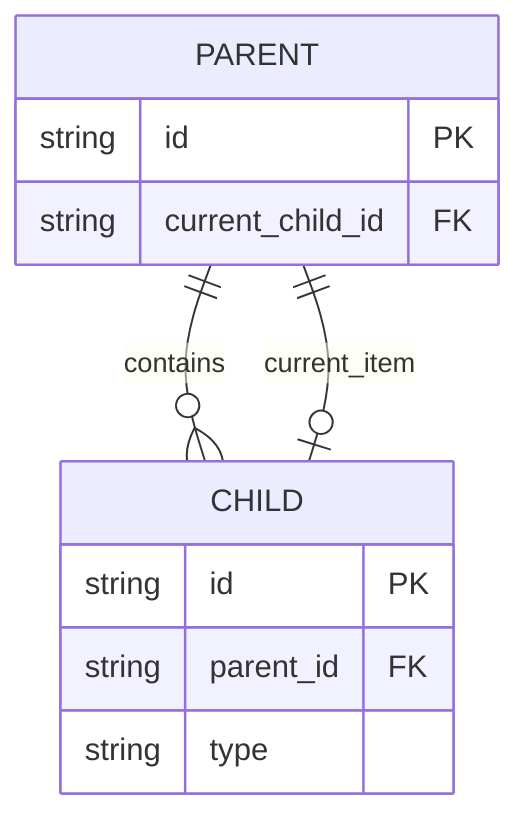
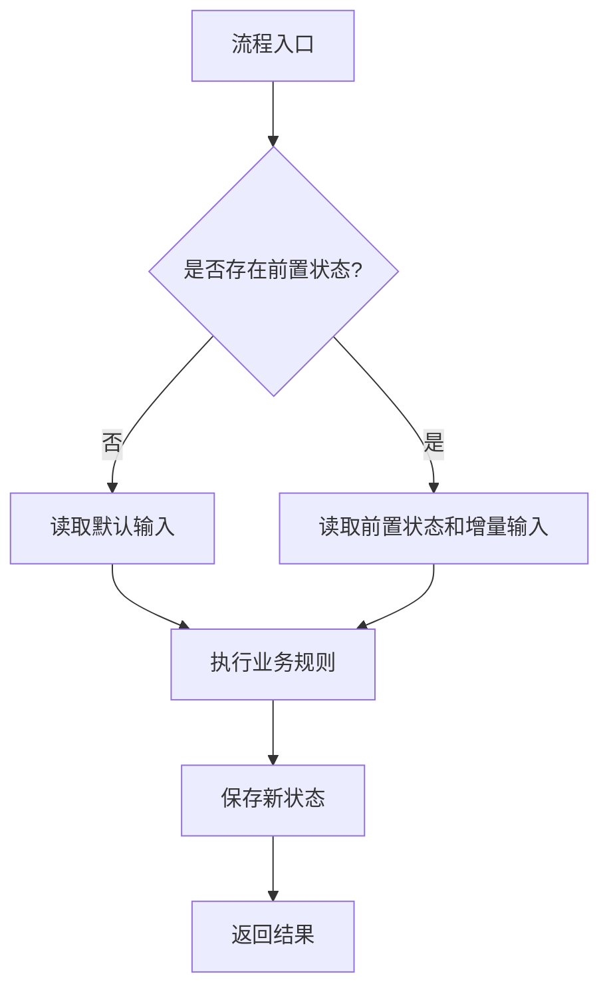

# CodingDoc 语法

CodingDoc 语法是一套面向 AI 编程代理的结构化设计文档语法。它不绑定任何具体业务领域，也不绑定任何编程语言。它使用 Markdown 编写，但真正的语义来自稳定的块、表格、图和约束。

目标是让设计文档可以被 AI 稳定翻译成多种实现语言和工程产物：

- Go 的 struct、interface、repository、service 和 test。
- Java 的 class、interface、repository 和 service。
- Python 的 dataclass、protocol、service 和 test。
- TypeScript 的 type、interface、service 和 API client。
- SQL 表、索引和查询。
- 用户明确要求时的重构或实施计划。

## 1. 文档语法

```text
CodingDoc =
  上下文
  + 组件
  + 实体
  + 关系
  + 流程
  + 契约
  + 决策
  + 不变量
  + 扩展点
```

不是每份文档都必须包含所有块。根据用户意图和模块性质选择。

## 2. 上下文块

使用“上下文”定义范围和边界。

```md
## 1. 上下文

| 项目 | 说明 |
| --- | --- |
| 范围 | [模块或能力名称] 的设计 |
| 读者 | AI 编程代理 / 工程师 |
| 目标 | [本设计要达成的结果] |
| 非目标 | [本设计明确不处理的内容] |
| 假设 | [当前设计依赖但尚未展开的前提] |
```

规则：

- 使用目标和非目标控制范围膨胀。
- 未确认内容放入假设或待确认问题，不要写成决策。
- 除非任务是问题分析或重构设计，否则不要默认加入“当前问题”。
- 示例必须使用当前文档所属业务，不要在语法规范中写入具体项目案例。

## 3. 组件块

使用“组件”描述 package、service、module 或运行时边界。

```md
## 组件：[组件名称]

| 项目 | 说明 |
| --- | --- |
| 职责 | [该组件负责什么] |
| 依赖 | [直接依赖的组件或外部系统] |
| 拥有 | [由该组件拥有的能力、方法或状态] |
| 不负责 | [明确不属于该组件的职责] |
```

规则：

- 同时写清楚组件负责什么和不负责什么。
- 写出直接依赖。
- 避免“处理业务逻辑”这类模糊职责。
- 一个组件的职责应能被翻译为类、接口、模块或服务边界。

## 4. 实体块

使用“实体”描述数据结构、表、record、领域模型、DTO 或事件。

```md
## 实体：[实体名称]

| 字段 | 类型 | 含义 | 约束 |
| --- | --- | --- | --- |
| ID | string | 唯一标识 | 主键 / 必填 |
| OwnerID | string | 所属对象标识 | 外键 / 可选 |
| Type | enum | 实体类型 | [枚举值 A] / [枚举值 B] |
| Payload | object | 承载的数据 | 按契约序列化 |
| CreatedAt | int64 | 创建时间 | Unix 时间戳 |
```

规则：

- 只列影响行为的字段，不必列所有偶然字段。
- 显式写出 enum 值。
- 写清默认值和约束。
- 如果实体会持久化，按需写出主键、外键、索引等存储字段。
- 字段命名可以使用目标项目已有命名，不必强制使用示例字段。

## 5. 关系块

使用“关系”展示所有权、外键、指针和一对多关系。



规则：

- 数据关系优先使用 E-R 图。
- 关系名称保持朴素，例如 contains、owns、current_item、references。
- 如果某个指针字段具有行为语义，在图后解释它。
- 不要把每个 DTO 都画成持久化实体。

## 6. 流程块

使用“流程”描述运行时行为。

```md
## 流程：[流程名称]

| 步骤 | 执行者 | 动作 | 输出 |
| --- | --- | --- | --- |
| 1 | [入口组件] | 读取输入和当前状态 | 初始上下文 |
| 2 | [协作组件] | 根据条件读取或构造数据 | 中间结果 |
| 3 | [入口组件] | 执行业务规则 | 处理结果 |
| 4 | [存储组件] | 保存状态变化 | 新状态 |
| 5 | [入口组件] | 返回结果或发布事件 | 输出 |
```



规则：

- 每个流程都要有入口。
- 每个分支都要写出选择条件。
- 每个流程都应终止于输出、状态变化、事件或错误。
- 使用步骤表保证精确，使用图表达结构。

## 7. 契约块

使用“契约”描述 API、service 方法、repository 查询、事件、协议和 tool schema。

```md
## 契约：[契约名称]

| 项目 | 说明 |
| --- | --- |
| 输入 | [输入参数或请求结构] |
| 默认行为 | [未传可选条件时的行为] |
| 支持条件 | [过滤、分页、排序或模式参数] |
| 输出 | [返回结构或事件] |
| 错误 | [可能错误或错误类别] |
| 副作用 | [状态更新、事件发布、外部调用] |
```

查询建议使用条件表：

```md
| 条件 | 查询语义 |
| --- | --- |
| 空条件 | 使用默认过滤条件 |
| Type=[指定类型] | 只返回指定类型的数据 |
| AfterID=x | 返回 x 之后的数据 |
| Limit=n | 最多返回 n 条数据 |
```

规则：

- 必须定义默认行为。
- 查询必须定义过滤、排序和分页语义。
- 事件必须定义类型、载荷、顺序和终止事件。
- 方法必须定义输入、输出、错误和副作用。

## 8. 决策块

使用“决策”记录采用和放弃的设计选择。

```md
## 决策：[决策名称]

| 项目 | 说明 |
| --- | --- |
| 决策 | [最终采用的设计选择] |
| 采用方案 | [采用方案的关键点] |
| 放弃方案 | [明确放弃的其他方案] |
| 原因 | [为什么采用当前方案] |
| 影响 | [该决策带来的约束、成本或收益] |
```

规则：

- 写出放弃方案，防止后续 AI 重新走旧路。
- 写出影响，因为决策通常会带来约束。
- 语气保持中性，不要过度包装采用方案。
- 不要把尚未确认的想法写成决策。

## 9. 不变量块

使用“不变量”描述实现必须保持的规则。

```md
## 不变量

| ID | 规则 |
| --- | --- |
| C1 | 默认查询必须遵守文档定义的默认过滤条件 |
| C2 | 内部状态不得作为用户可见数据默认返回 |
| C3 | 持久化实体之间的指针必须指向对应类型的数据 |
| C4 | 组件不得越过文档定义的职责边界 |
```

规则：

- 不变量必须写成绝对规则。
- 每条规则尽量可测试。
- 每行只写一个规则。
- 不变量是后续 AI 实现时最重要的防偏信息。

## 10. 扩展点块

使用“扩展点”描述未来方向，但不要把它变成当前需求。

```md
## 扩展点

| ID | 扩展点 | 后续方向 |
| --- | --- | --- |
| X1 | [扩展点名称] | [未来可能接入的能力] |
| X2 | [扩展点名称] | [未来可能扩展的数据类型或流程] |
```

规则：

- 扩展点不能变成隐含的当前需求。
- 如果扩展点影响当前设计，需要说明预留了什么边界。
- 扩展点不应包含具体实施步骤，除非用户明确要求计划。

## 11. 翻译规则

面向 AI 代码翻译时，各设计元素应能映射为：

| 设计元素 | AI 可翻译为 |
| --- | --- |
| 实体表 | struct / class / interface / table schema |
| 关系图 | foreign key、reference、repository query |
| 流程表 | service 方法逻辑 |
| 契约表 | 方法签名、handler、query object |
| 决策表 | 注释、架构文档、规避方案 |
| 不变量表 | 测试、校验、guard clause |
| 扩展表 | interface、无 TODO 的边界、后续文档 |

避免：

- 用长段落隐藏需求。
- 使用没有定义行为的“处理”“管理”“执行”等模糊动词。
- 在同一章节混写当前决策和未来想法。
- 在设计文档中写实施步骤，除非用户明确要求。
- 在语法规范中写入某个具体业务的实体、流程或字段。

