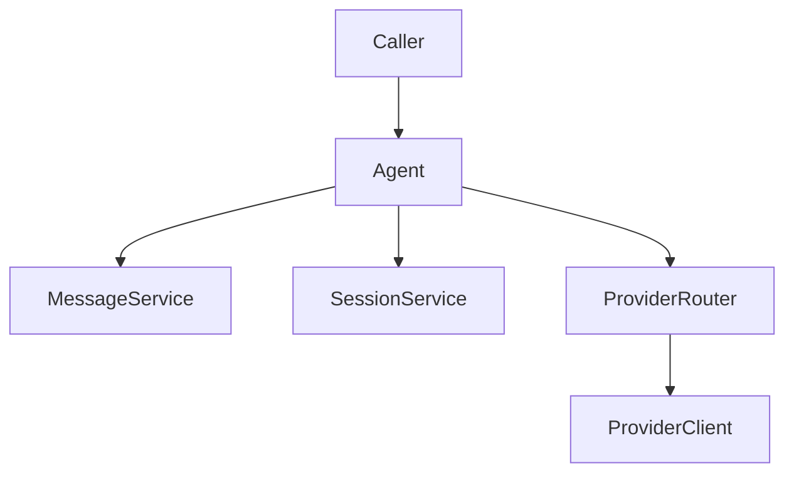
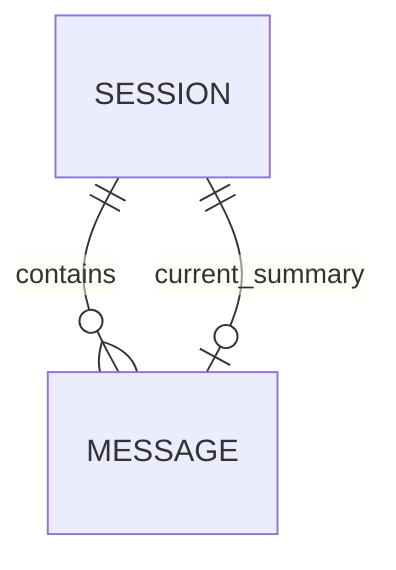
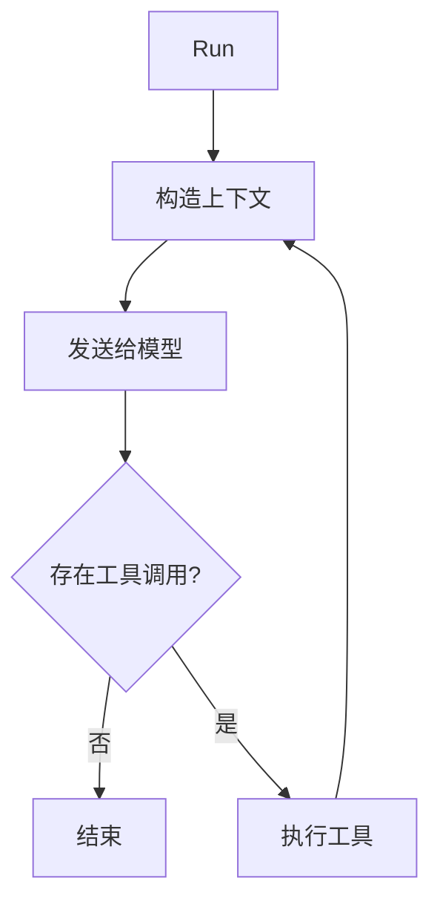
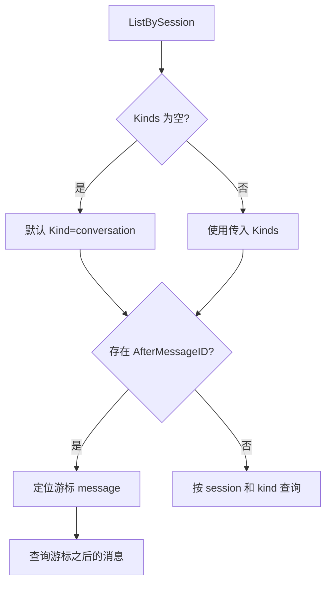
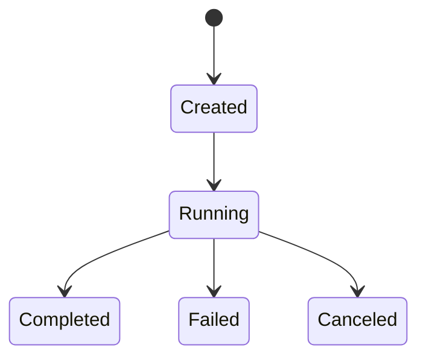

# 图表模式

使用图表暴露自然语言容易隐藏的结构。优先使用简单 Mermaid 图，不追求复杂视觉表达。

## 1. 模块架构图

用于描述 package、module、service 和依赖边界。



应包含：

- 调用方或入口。
- 主组件。
- 直接依赖。
- 外部边界。

避免：

- 展示每个文件。
- 在同一张图里混合运行流程和依赖结构。

## 2. E-R 图

用于描述持久化数据、领域实体、所有权和指针关系。



应包含：

- 实体名称。
- 必要时包含关键字段。
- 关系标签。

避免：

- 把每个 DTO 都画成数据库实体。
- 漏掉真正驱动行为的关系。

## 3. Run 流程图

用于描述请求生命周期和运行时执行路径。



应包含：

- 入口。
- 分支条件。
- 回环。
- 终止状态。

## 4. 查询流程图

用于描述过滤、默认值、分页、排序和游标行为。



应包含：

- 默认分支。
- 显式条件分支。
- 有游标时的定位逻辑。

## 5. 状态流转图

用于描述生命周期和状态变化。



应包含：

- 初始状态。
- 终止状态。
- 错误和取消路径。

## 6. 决策表

用于描述架构取舍。

```md
| 项目 | 说明 |
| --- | --- |
| 决策 | 复用 Message 表并增加 Kind |
| 采用方案 | Message.Kind = conversation / summary |
| 放弃方案 | 新增 Summary 表；Session 保存 SummaryText |
| 原因 | 避免新增 repo，同时保持默认历史查询干净 |
| 影响 | ListBySession 必须支持条件查询 |
```

应包含：

- 采用方案。
- 放弃方案。
- 原因。
- 影响。

