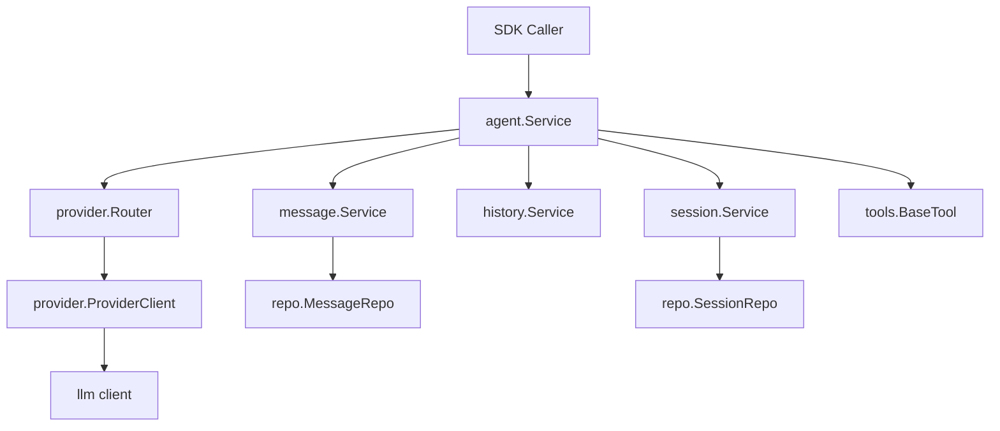
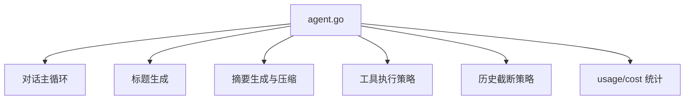
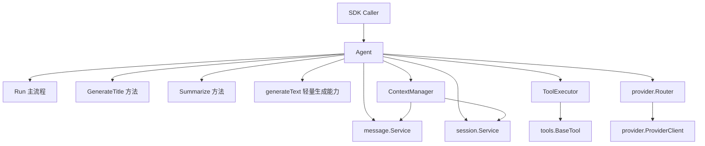
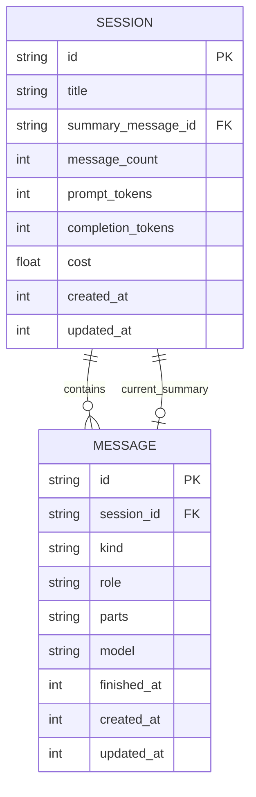
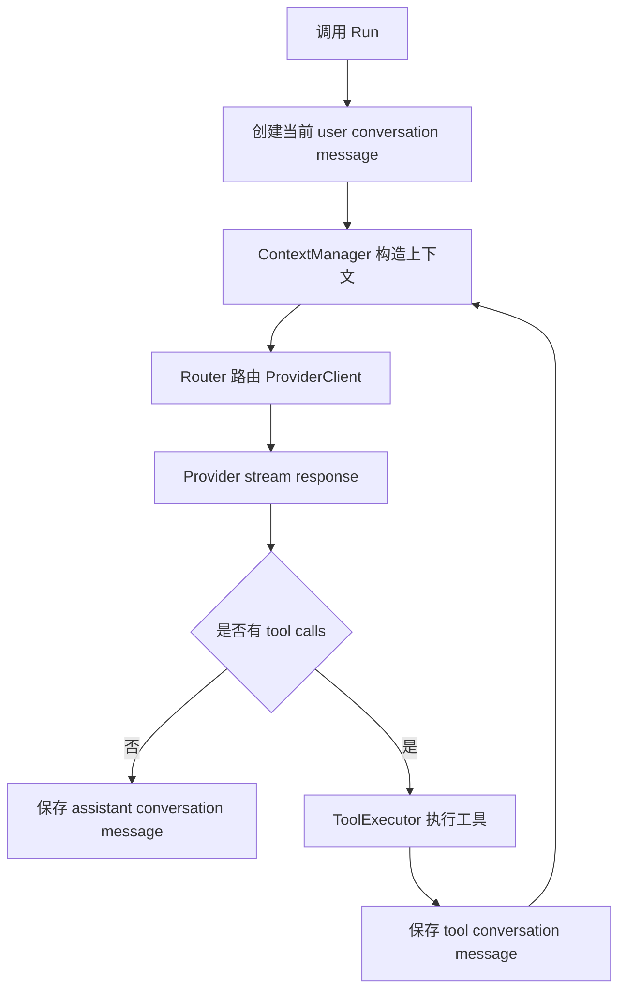
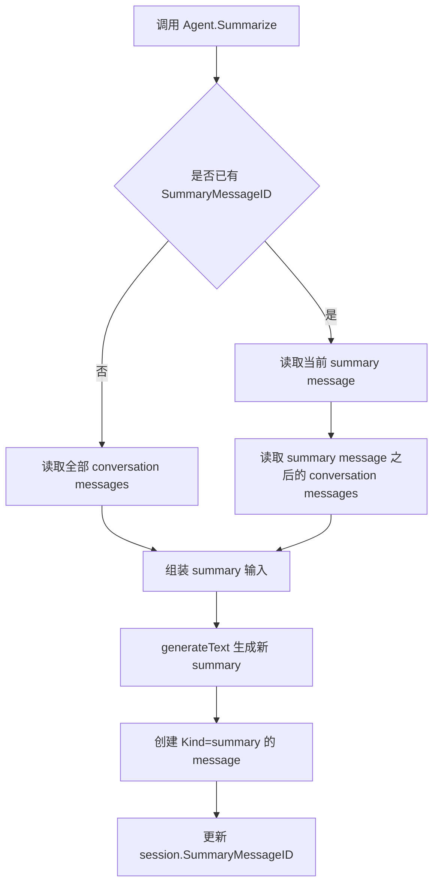
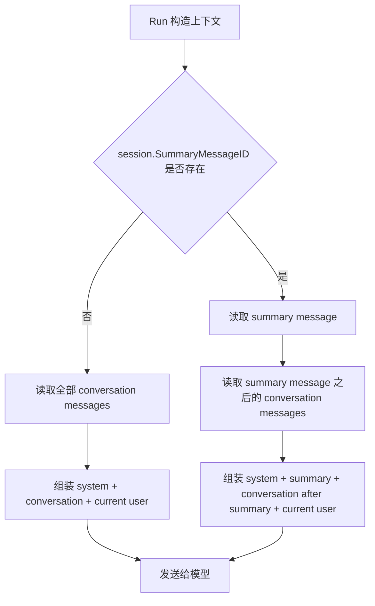
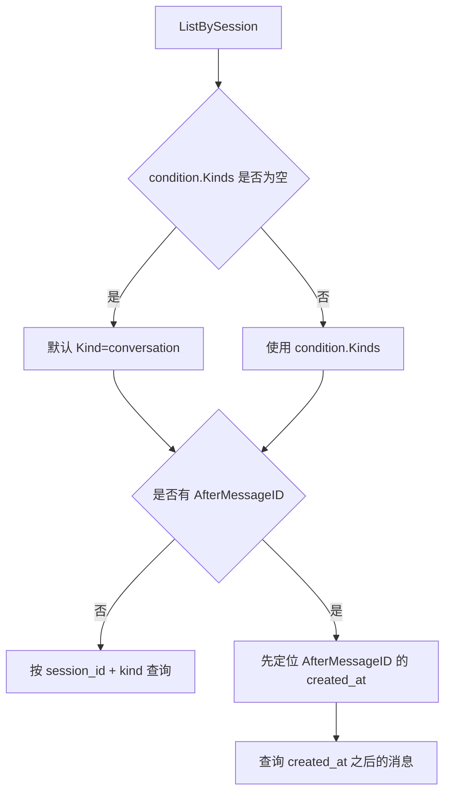

# Agent 设计问题与目标架构

最后更新：2026-05-11

本文是 Agent SDK 当前 Agent 模块的设计文档，重点描述当前问题、目标架构、核心实体、关键流程和设计决策。本文不包含实施步骤和开发任务拆分。

## 1. 设计目标与非目标

### 1.1 设计目标

| 序号 | 目标 | 说明 |
| --- | --- | --- |
| G1 | 保持 Agent 职责固定 | 一个 Agent 实例代表一个固定职责的运行体，创建时确定 Prompt、Model、Provider、Tools 和 Memory。 |
| G2 | 保持 Router 边界 | `provider.Router` 继续作为 Provider/Model 到 ProviderClient 的路由边界，不新增职责重叠的 ModelSelector。 |
| G3 | Title/Summary 作为 Agent 基础方法 | Title 和 Summary 是每个 Agent 都具备的基础能力，不通过主 Agent 集成子 Agent 完成。 |
| G4 | 区分真实对话与内部 summary | 防止 SDK 宿主误展示、误导出、误参与 RAG 引用。 |
| G5 | 保持默认历史查询友好 | `messages.List` 默认面向真实对话历史，对 CLI、Web 和普通 SDK 调用保持友好。 |
| G6 | 预留上下文管理边界 | 为后续 ContextManager、AutoCompact、RAG 上下文组织预留设计空间。 |
| G7 | 预留工具执行边界 | 为后续 ToolExecutor 支持并行、权限确认、超时、事件等策略预留边界。 |

### 1.2 非目标

| 序号 | 非目标 | 说明 |
| --- | --- | --- |
| N1 | 不设计自动 compact 触发策略 | 何时自动 summary、token 阈值、触发比例后续再设计。 |
| N2 | 不设计上下文超限后的分批 summary | 当前阶段 Summary 被调用时直接发送给大模型。 |
| N3 | 不新增独立 Summary 表 | 当前方案复用 Message 表，通过 `Kind` 区分。 |
| N4 | 不引入 ModelSelector | Router 已经承担 provider/model 路由职责。 |
| N5 | 不定义完整 CLI/Web/RAG 产品接口 | 本文只描述 Agent 内部设计边界。 |
| N6 | 不包含实施步骤 | 本文不包含任务拆分、迁移脚本和验收清单。 |

## 2. 当前问题

| 序号 | 问题 | 当前表现 | 影响 |
| --- | --- | --- | --- |
| P1 | Summary 与普通消息混用 | `Summarize` 将 summary 保存成普通 `assistant` message，下一次 `Run` 又临时改成 `user` 发送给模型。 | summary 同时像聊天消息、压缩状态和模型输入材料，语义不清。 |
| P2 | 默认历史查询会混入 summary | session 下的 messages 查询会查出 summary。 | Web/CLI/导出历史容易误展示内部摘要。 |
| P3 | 工具执行策略堆在 Agent 主流程 | 工具查找、执行、权限、取消、结果组装都集中在 `agent.go`。 | 后续并行、确认、超时、审计、事件会让主流程膨胀。 |
| P4 | Run 对外事件粒度不足 | Agent 内部使用 Provider stream，但 `Run` 对调用方暴露的事件不够完整。 | CLI/Web 难以直接实现流式输出、工具生命周期展示和错误处理。 |
| P5 | SDK 公共边界偏 internal | 主要代码在 `internal/*` 下。 | 独立 AgentCLI、Web 服务、RAG 服务复用时会遇到 Go internal 导入限制。 |

## 3. 当前架构

### 3.1 当前模块关系



### 3.2 当前 Agent 内部职责堆叠



## 4. 目标架构

### 4.1 目标模块关系



### 4.2 目标职责说明

| 序号 | 模块 | 职责 |
| --- | --- | --- |
| A1 | Agent | 对外主要入口，负责 Run、GenerateTitle、Summarize 等基础能力。 |
| A2 | generateText | Agent 内部轻量文本生成能力，用于 Title/Summary 等简单文本生成。 |
| A3 | ContextManager | 组织 system、summary、历史消息、当前输入和未来 RAG 内容。 |
| A4 | ToolExecutor | 承担工具查找、执行、权限、取消、结果组装和生命周期事件。 |
| A5 | Router | 根据 Provider + ModelID 路由到 ProviderClient。 |
| A6 | MessageService | 管理 conversation 与 summary 两类 message。 |
| A7 | SessionService | 管理会话元信息和当前 SummaryMessageID。 |

## 5. 核心实体 E-R

### 5.1 实体关系图



### 5.2 核心实体说明

| 序号 | 实体 | 核心字段 | 设计说明 |
| --- | --- | --- | --- |
| E1 | Agent | Prompt、ModelTarget、Tools、Memory | 一个固定职责的运行体，创建后不在运行中做任务级模型选择。 |
| E2 | Session | `SummaryMessageID` | 保存会话元信息和当前有效 summary 指针，不保存 summary 正文。 |
| E3 | Message | `Kind`、`Role`、`Parts`、`Model` | 复用一张表保存真实对话和内部 summary，通过 `Kind` 区分。 |
| E4 | Summary Message | `Kind = summary` | 内部上下文压缩结果，不是用户可见普通 assistant 回复。 |
| E5 | Conversation Message | `Kind = conversation` | 用户、助手、工具之间真实发生过的对话消息。 |
| E6 | ContextManager | summary + history + current input | 负责一次模型请求上下文组织。 |
| E7 | ToolExecutor | tool calls + tool results | 负责工具执行策略。 |

### 5.3 MessageKind

```go
type MessageKind string

const (
    MessageKindConversation MessageKind = "conversation"
    MessageKindSummary      MessageKind = "summary"
)
```

| Kind | 语义 | 默认是否对 SDK 宿主可见 |
| --- | --- | --- |
| `conversation` | 真实对话消息，包括 user、assistant、tool。 | 是 |
| `summary` | Agent 内部 summary 消息。 | 否 |

## 6. 核心流程

### 6.1 普通 Run 流程



### 6.2 Summary 生成流程

当前阶段不处理上下文是否已满，也不处理分批 summary。调用 Summary 时直接把输入发送给大模型生成新的 summary。



输入规则：

| 场景 | Summary 输入 |
| --- | --- |
| 第一次 summary | 全部 conversation messages |
| 再次 summary | 旧 summary message + `SummaryMessageID` 之后的 conversation messages |

### 6.3 带 Summary 的上下文组装流程



### 6.4 ListBySession 查询流程

`ListBySession` 需要支持 condition 查询，避免默认查出 summary。



查询语义：

| 查询 | 返回 |
| --- | --- |
| `ListBySession(sessionID, MessageListCondition{})` | 默认返回 `Kind = conversation` 的真实对话消息。 |
| `ListBySession(sessionID, MessageListCondition{Kinds: [summary]})` | 返回 summary message。 |
| `ListBySession(sessionID, MessageListCondition{Kinds: [conversation], AfterMessageID: session.SummaryMessageID})` | 返回 summary 之后的真实对话消息，用于组装模型上下文。 |

## 7. 关键设计决策

### 7.1 D1 不新增 ModelSelector

| 项目 | 内容 |
| --- | --- |
| 决策 | 不新增 ModelSelector。 |
| 原因 | 当前已有 `provider.Router`；一个 Agent 的职责、Provider、Model 在创建时已经固定；Title/Summary 是 Agent 方法，不是任务级动态模型选择。 |
| 放弃方案 | 在 Agent 内部按 task/purpose 动态选择模型。 |
| 影响 | Router 继续作为 Provider/Model 路由边界；如果未来需要不同模型，应创建不同职责的 Agent 或通过 Agent 配置解决。 |

### 7.2 D2 Title/Summary 是 Agent 基础方法

| 项目 | 内容 |
| --- | --- |
| 决策 | Title 和 Summary 是每个 Agent 都应具备的基础方法。 |
| 原因 | 标题和摘要是会话管理能力，不是独立子任务 Agent；作为方法更适合 SDK 宿主使用；内部可复用 `generateText` 轻量文本生成能力。 |
| 放弃方案 | 主 Agent 集成 Title Agent / Summary Agent 子 Agent。 |
| 影响 | API 更简单；不需要为了标题和摘要额外创建 session 或子 Agent。 |

### 7.3 D3 Summary 复用 Message 表并增加 Kind

| 项目 | 内容 |
| --- | --- |
| 决策 | 不新增 Summary 表，复用 Message 表，增加 `Kind` 区分 `conversation` 与 `summary`。 |
| 原因 | 避免新增 SummaryRepo 和 service；复用现有 message parts/model/time 存储结构；通过 `Kind` 解决 summary 与普通消息混用问题。 |
| 放弃方案 | 仅靠 `SummaryMessageID` 区分 summary；将 summary 正文直接存入 session；新增独立 Summary 表。 |
| 影响 | `messages.List` 默认必须过滤 `Kind = conversation`；summary 需要通过专门条件查询或 `SummaryMessageID` 单独读取。 |

### 7.4 D4 ListBySession 支持条件查询

| 项目 | 内容 |
| --- | --- |
| 决策 | `ListBySession` 不再固定查询 session 下所有 message，而是支持 condition。 |
| 原因 | UI 历史只需要真实 conversation；模型上下文需要读取 summary 之后的 conversation；Summary 流程需要读取 summary message 和后续新增历史。 |
| 影响 | 默认查询语义必须稳定：不传条件时只返回 conversation；内部上下文组装使用显式 condition。 |

### 7.5 D5 ToolExecutor 后续独立成策略边界

| 项目 | 内容 |
| --- | --- |
| 决策 | 工具执行策略应从 Agent 主流程中形成独立边界。 |
| 原因 | 工具执行会随着 CLI、Web、RAG 变复杂；Agent 主流程应保持“模型响应、工具结果、继续对话”的编排职责。 |
| 影响 | 后续可以扩展并行、权限确认、超时、事件、审计等能力。 |

## 8. 设计约束

| 序号 | 约束 |
| --- | --- |
| C1 | `messages.List` 默认不得返回 `Kind = summary` 的内部消息。 |
| C2 | summary message 不应作为用户可见的普通 assistant 回复展示。 |
| C3 | summary message 不应在发送给模型前临时改成 user role。 |
| C4 | Session 不保存 summary 正文，只保存 `SummaryMessageID` 指针。 |
| C5 | Router 仍是模型路由边界。 |
| C6 | Title/Summary 作为 Agent 方法存在，不采用子 Agent 集成方案。 |
| C7 | Summary 阶段暂不处理上下文超限、分批压缩和自动触发。 |
| C8 | 普通 conversation messages 应保留真实对话历史，不因 summary 生成而删除。 |

## 9. 扩展点

| 序号 | 扩展点 | 后续方向 |
| --- | --- | --- |
| X1 | ContextManager | 接入 AutoCompact、RAG retrieved chunks、memory snippets、prompt budget 管理和上下文优先级排序。 |
| X2 | MessageKind | 后续可扩展为 `memory`、`rag_context`、`system_note` 等内部消息类型。 |
| X3 | Summary 存储 | 若需要 summary 版本管理、审计、回滚、多种 summary 类型，可再考虑独立 Summary 表。 |
| X4 | ToolExecutor | 支持并行工具执行、工具级 timeout、用户确认、retry、tool_start/tool_done/tool_error 事件和工具审计日志。 |
| X5 | AgentEvent | 扩展为完整运行时事件协议，例如 response_delta、reasoning_delta、tool_start、tool_result、usage、done、error。 |

