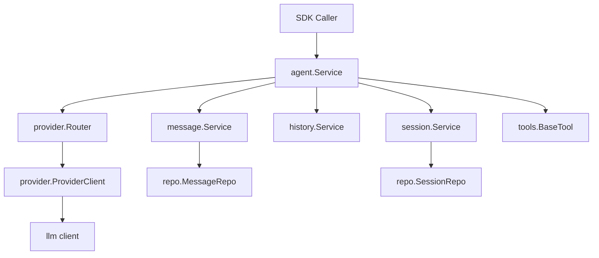
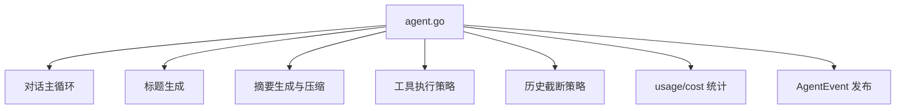
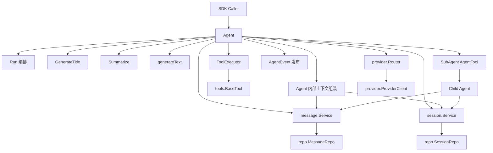
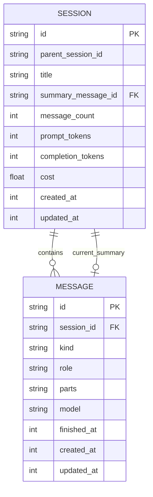
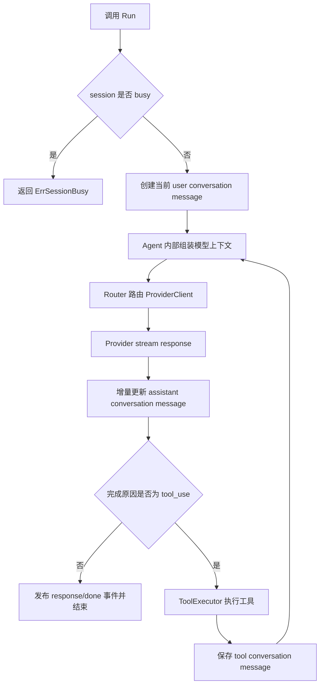
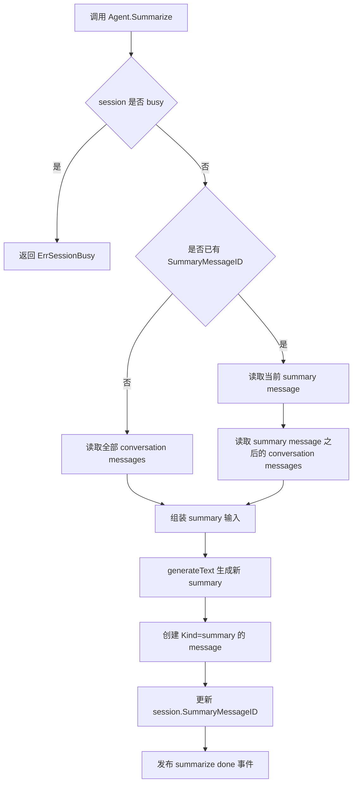
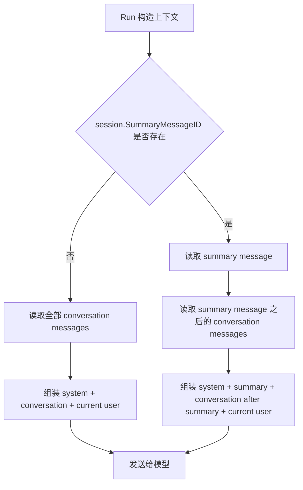
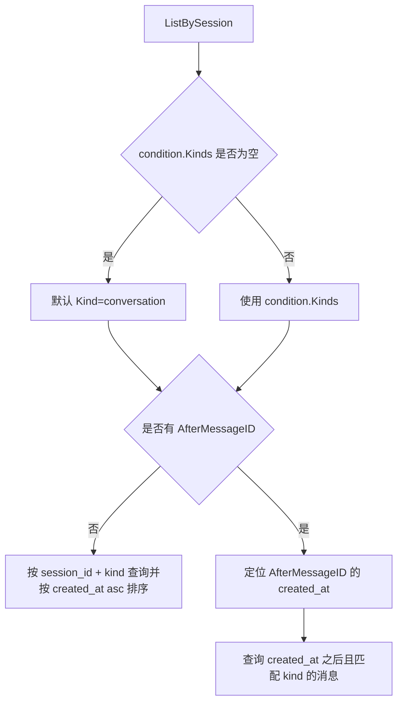

# Agent 模块问题与目标架构设计

最后更新：2026-05-13

本文是 Agent SDK 当前 Agent 模块的改造设计文档，面向后续 AI 编程代理和工程师。本文描述当前问题、目标边界、核心实体、运行流程、服务契约、设计决策和不变量；本文不包含实施步骤、迁移脚本和任务拆分。

## 1. 上下文

| 项目 | 说明 |
| --- | --- |
| 范围 | `internal/agent`、`internal/memory/message`、`internal/memory/session`、`internal/data/repo` 中与 Agent 运行、summary、消息查询、提示词配置、sub agent 注册和工具执行边界相关的设计。 |
| 读者 | AI 编程代理、Agent SDK 维护者、需要复用 Agent 能力的 CLI/Web/RAG 宿主。 |
| 目标 | 明确 Agent 的稳定职责边界，解决 summary 与真实对话混用问题，并为上下文组装、ToolExecutor、AgentEvent 后续独立演进预留边界。 |
| 非目标 | 不设计自动 compact 策略、不设计分批压缩、不新增完整产品层接口、不拆分具体开发任务。 |
| 当前事实 | 现有 `message.Message` 没有 `Kind` 字段，`MessageRepo.ListBySession` 只按 `session_id` 查询全部消息，`agent.Summarize` 会创建普通 assistant message 并写入 `Session.SummaryMessageID`。 |
| 核心风险 | 如果不显式区分内部 summary 和真实 conversation，SDK 宿主容易误展示、误导出、误检索、误发送内部压缩状态。 |

## 2. 设计目标与非目标

### 2.1 设计目标

| ID | 目标 | 说明 |
| --- | --- | --- |
| G1 | 保持 Agent 职责固定 | 一个 Agent 实例代表一个固定职责的运行体，创建时确定 system prompt、provider、model、tools 和 memory services。 |
| G2 | 保持 Router 边界 | `provider.Router` 继续作为 `Provider + ModelID -> ProviderClient` 的唯一路由边界，不新增职责重叠的 ModelSelector。 |
| G3 | Title/Summary 作为 Agent 基础方法 | 标题生成和摘要生成是会话管理能力，属于 Agent 基础方法，不通过主 Agent 集成子 Agent 完成。 |
| G4 | 区分真实对话与内部 summary | summary 是内部上下文压缩状态，不是用户可见 assistant 回复，也不是默认历史导出的 conversation。 |
| G5 | 保持默认历史查询友好 | 默认 message list 行为面向真实对话历史，对 CLI、Web 和普通 SDK 调用保持安全直觉。 |
| G6 | 暂缓独立 ContextManager | 当前阶段不新增独立 `ContextManager` 类型；上下文组装仍由 Agent 主流程内的局部逻辑完成，但必须使用明确的 summary/conversation 查询语义，为后续抽取边界预留接口形态。 |
| G7 | 预留 ToolExecutor 边界 | 工具执行策略由独立边界承接，后续可扩展并行、权限确认、超时、retry、审计和生命周期事件。 |
| G8 | 明确 AgentEvent 演进方向 | 当前事件可继续兼容，目标边界需要能表达模型增量、工具生命周期、用量、完成和错误。 |
| G9 | 简化 Prompt 配置边界 | SDK 核心层只消费 prompt 字符串，不负责 prompt 来源加载；主 Agent、title、summary 和 sub agent prompt 通过 Option 显式配置。 |
| G10 | 支持 SubAgent 注册 | 外部通过 `WithSubAgents(...SubAgentConfig)` 注册 sub agent；每个 sub agent 被包装成一个 `AgentTool` 并进入主 Agent 工具集。 |

### 2.2 非目标

| ID | 非目标 | 说明 |
| --- | --- | --- |
| N1 | 不设计自动 compact 触发策略 | 何时自动 summary、token 阈值、触发比例、回退策略后续单独设计。 |
| N2 | 不设计上下文超限后的分批 summary | 当前阶段 `Summarize` 被调用时直接生成新 summary，不处理长上下文分片。 |
| N3 | 不新增独立 Summary 表 | 当前目标复用 Message 表，通过 `Kind` 区分 `conversation` 和 `summary`。 |
| N4 | 不引入 ModelSelector | Router 已经承担 provider/model 路由职责。 |
| N5 | 不定义完整 CLI/Web/RAG 产品接口 | 本文只定义 Agent SDK 内部边界和可复用契约。 |
| N6 | 不包含实施步骤 | 本文不包含任务拆分、迁移脚本、验收清单和发布计划。 |
| N7 | 不实现独立 ContextManager | 本阶段只修正上下文组装语义，不新增 `ContextManager` 结构体、接口或 package；后续在 RAG、AutoCompact、prompt budget 进入实现时再抽取。 |
| N8 | 不实现 Prompt 加载器 | SDK 核心层不负责从文件、目录、数据库、远程配置或环境变量加载 prompt；宿主负责加载并传入字符串。 |

## 3. 当前问题

| ID | 问题 | 当前表现 | 影响 |
| --- | --- | --- | --- |
| P1 | Summary 与普通消息混用 | `Summarize` 将 summary 保存成普通 `assistant` message，下一次 `Run` 又临时把该消息 role 改成 `user` 发送给模型。 | summary 同时像聊天消息、压缩状态和模型输入材料，语义不稳定。 |
| P2 | 默认历史查询会混入 summary | `message.Service.List` 和 `MessageRepo.ListBySession` 当前会查出 session 下全部 message。 | Web/CLI/导出历史容易误展示内部摘要，RAG 也可能误引用 summary。 |
| P3 | 工具执行策略堆在 Agent 主流程 | 工具查找、执行、权限拒绝、取消、结果组装集中在 `agent.go` 的生成流程中。 | 后续并行、确认、超时、审计和事件会让 Agent 主流程继续膨胀。 |
| P4 | Run 对外事件粒度不足 | Provider stream 内部有 delta/tool/complete/error，但 `AgentEvent` 当前主要暴露 `response`、`summarize`、`error`。 | CLI/Web 难以直接呈现流式文本、推理增量、工具生命周期和用量。 |
| P5 | SDK 公共边界偏 `internal` | 主要代码位于 `internal/*`。 | 独立 AgentCLI、Web 服务、RAG 服务复用时会遇到 Go `internal` 导入限制。 |
| P6 | Summary 输入边界不清 | 再次 summary 时缺少显式查询“旧 summary + 旧 summary 之后 conversation”的契约。 | 后续实现可能重复压缩、漏压缩，或把 summary 当普通历史再压缩。 |

## 4. 组件边界

### 4.1 当前模块关系



### 4.2 当前 Agent 内部职责堆叠



### 4.3 目标模块关系



### 4.4 目标组件职责

| ID | 组件 | 职责 | 依赖 | 不负责 |
| --- | --- | --- | --- | --- |
| Cmp1 | Agent | 对外暴露 `Run`、`Summarize`、`GenerateTitle`、`Cancel`、`Update` 等基础能力；编排模型响应、工具结果、消息保存和当前阶段的上下文组装。 | `session.Service`、`message.Service`、`provider.Router`、`tools.BaseTool`。 | 不直接承担复杂上下文预算、不内联复杂工具策略、不做任务级模型选择。 |
| Cmp2 | Agent 内部上下文组装 | 为一次模型请求构造 summary、conversation after summary 和 current input；当前作为 Agent 内部局部逻辑存在，不作为独立组件实现。 | `session.Service`、`message.Service`。 | 不生成 summary、不执行工具、不路由 provider、不处理 RAG/AutoCompact/prompt budget。 |
| Cmp3 | ToolExecutor | 根据 tool call 查找工具、执行工具、处理取消/权限/错误，并生成 tool result message 所需 parts。 | `tools.BaseTool`、运行时 context。 | 不保存 assistant message、不决定模型是否继续对话。 |
| Cmp4 | MessageService | 管理 `conversation` 与 `summary` 两类 message，提供默认安全的 list 行为和显式条件查询。 | `repo.MessageRepo`。 | 不理解模型上下文预算、不直接更新 session summary 指针。 |
| Cmp5 | SessionService | 管理 session 元信息、usage/cost 和 `SummaryMessageID`。 | `repo.SessionRepo`。 | 不保存 summary 正文、不查询 message parts。 |
| Cmp6 | Router | 根据 `Provider + ModelID` 返回 `ProviderClient`。 | provider target map。 | 不根据 task/purpose 动态选择模型。 |
| Cmp7 | AgentEvent | 表达 Agent 运行时事件，供 CLI/Web/SDK 宿主订阅。 | Agent 主流程、ToolExecutor、Provider stream。 | 不作为持久化消息的唯一来源。 |
| Cmp8 | SubAgent AgentTool | 将外部注册的 `SubAgentConfig` 包装为主 Agent 可调用工具；执行时创建 child session 和 child Agent，并把最终结果作为 tool result 返回父 Agent。 | `session.Service`、`message.Service`、`history.Service`、`provider.Router`、sub agent tools。 | 不共享父 Agent 对话历史、不复制 child session 全量消息到父 session、不负责加载 prompt 来源。 |

## 5. 核心实体与关系

### 5.1 实体关系图



### 5.2 实体字段

| 实体 | 字段 | 类型 | 含义 | 约束 |
| --- | --- | --- | --- | --- |
| Agent | `provider` | `models.ModelProvider` | 当前 Agent 固定 provider。 | 创建后默认固定；`Update` 只能在非 busy 状态修改 model，不改变任务级路由语义。 |
| Agent | `modelID` | `models.ModelID` | 当前 Agent 固定 model。 | 与 `provider` 一起交给 Router 路由。 |
| Agent | `systemPrompt` | string | 当前 Agent 的 system prompt。 | 由 `WithSystemValue(prompt string)` 配置；为空时使用 SDK 内置默认 coder prompt。 |
| Agent | `titlePrompt` | string | 标题生成 prompt。 | 固定默认值；`WithTitlePrompt(prompt string)` 非空时覆盖。 |
| Agent | `summarizerPrompt` | string | summary 生成 prompt。 | 固定默认值；`WithSummarizerPrompt(prompt string)` 非空时覆盖。 |
| Agent | `tools` | `[]tools.BaseTool` | 当前 Agent 可调用工具集合。 | 工具可用性在 Agent 创建或配置时确定。 |
| SubAgentConfig | `Name` | string | sub agent 工具名。 | 必填；在主 Agent tool set 中唯一。 |
| SubAgentConfig | `Description` | string | sub agent 工具描述。 | 必填；用于模型判断何时调用该 sub agent。 |
| SubAgentConfig | `SystemPrompt` | string | sub agent 的 system prompt。 | 必填或使用 SDK 提供的默认 task prompt；由宿主传入，不由 SDK 加载。 |
| SubAgentConfig | `Tools` | `[]tools.BaseTool` | sub agent 可用工具。 | 可空；为空时使用只读 workspace 工具默认集。 |
| SubAgentConfig | `Model` | `*ModelTarget` | sub agent 可选模型覆盖。 | 为空时继承主 Agent 的 provider/model。 |
| Session | `ID` | string | 会话主键。 | 必填；`SummaryMessageID` 指向的 message 必须属于同一 session。 |
| Session | `SummaryMessageID` | string | 当前有效 summary message 指针。 | 可空；非空时必须指向 `Kind = summary` 的 message。 |
| Session | `MessageCount` | int64 | session 下 message 计数。 | 包含 conversation 和 summary message；不能作为默认可见 conversation 数量。 |
| Message | `ID` | string | 消息主键。 | 必填。 |
| Message | `SessionID` | string | 所属 session。 | 必填；查询默认按 session 隔离。 |
| Message | `Kind` | `MessageKind` | 消息用途。 | 默认值为 `conversation`；允许值见 5.3。 |
| Message | `Role` | `MessageRole` | 模型协议角色。 | `conversation` 可为 user/assistant/tool/system；`summary` 不得作为用户可见 assistant 回复展示。 |
| Message | `Parts` | `[]ContentPart` JSON | 文本、推理、附件、工具调用、工具结果、finish 等内容。 | 必须由结构化 part wrapper 序列化，不使用 ad hoc 字符串拼接。 |
| Message | `Model` | `models.ModelID` | 生成该消息的模型。 | 用户/tool message 可为空；assistant/summary message 应记录模型。 |

### 5.3 MessageKind

```go
type MessageKind string

const (
    MessageKindConversation MessageKind = "conversation"
    MessageKindSummary      MessageKind = "summary"
)
```

| Kind | 语义 | 默认是否对 SDK 宿主可见 | 典型来源 |
| --- | --- | --- | --- |
| `conversation` | 用户、助手、工具之间真实发生过的对话消息。 | 是 | `Run` 创建 user/assistant/tool message。 |
| `summary` | Agent 内部上下文压缩结果。 | 否 | `Summarize` 生成并由 `Session.SummaryMessageID` 指向。 |

### 5.4 内容 Part 类型

| Part | 语义 | 可用于 conversation | 可用于 summary |
| --- | --- | --- | --- |
| `TextContent` | 自然语言文本。 | 是 | 是，summary 正文应使用此类型。 |
| `ReasoningContent` | 模型推理增量。 | 是 | 否，summary 不保存推理过程。 |
| `ImageURLContent` | 图片 URL 输入。 | 是 | 否。 |
| `BinaryContent` | 附件二进制输入。 | 是 | 否。 |
| `ToolCall` | assistant 发出的工具调用。 | 是 | 否。 |
| `ToolResult` | tool message 承载的工具结果。 | 是 | 否。 |
| `Finish` | 消息完成原因和时间。 | 是 | 是。 |

## 6. 核心流程

### 6.1 普通 Run 流程



| 步骤 | 执行者 | 动作 | 输出 |
| --- | --- | --- | --- |
| 1 | Agent | 检查 `sessionID` 是否正在运行请求。 | busy 时返回 `ErrSessionBusy`。 |
| 2 | Agent | 创建 `Kind=conversation, Role=user` 的当前用户消息。 | user message。 |
| 3 | Agent | 按 6.3 在 Agent 内部组装本轮模型上下文。 | provider request messages。 |
| 4 | Router | 使用 Agent 固定 `Provider + ModelID` 路由。 | `ProviderClient`。 |
| 5 | Agent | 流式接收 provider event 并更新 assistant message。 | `Kind=conversation, Role=assistant` message。 |
| 6 | Agent | 如果 finish reason 是 `tool_use`，把 tool calls 交给 ToolExecutor。 | tool results。 |
| 7 | Agent | 保存 `Kind=conversation, Role=tool` 的工具结果消息，并继续下一轮模型请求。 | 新上下文输入。 |
| 8 | Agent | 如果没有工具调用或模型最终完成，发布 done 事件。 | 最终 AgentEvent。 |

### 6.2 Summary 生成流程

当前阶段不处理上下文是否已满，也不处理分批 summary。调用 `Summarize` 时直接生成新的 summary message。



| 场景 | Summary 输入 | 输出 |
| --- | --- | --- |
| 第一次 summary | 全部 `Kind=conversation` messages。 | 新 `Kind=summary` message，session 指针指向该 message。 |
| 再次 summary | 旧 `Kind=summary` message + `SummaryMessageID` 之后的 `Kind=conversation` messages。 | 新 `Kind=summary` message，session 指针更新为新 message。 |
| 无 conversation | 返回错误或发布 error event。 | 不创建 summary message。 |

### 6.3 带 Summary 的上下文组装流程



| 步骤 | 执行者 | 动作 | 输出 |
| --- | --- | --- | --- |
| 1 | Agent | 读取 session。 | `SummaryMessageID` 状态。 |
| 2 | Agent | 如果没有 summary，查询全部 `Kind=conversation` messages。 | 完整 conversation。 |
| 3 | Agent | 如果有 summary，读取该 summary message，并校验它属于当前 session 且 `Kind=summary`。 | 当前有效 summary。 |
| 4 | Agent | 如果有 summary，查询 summary 之后的 `Kind=conversation` messages。 | 增量 conversation。 |
| 5 | Agent | 组装 system prompt、summary、conversation、current user input。 | provider request messages。 |

### 6.4 ListBySession 查询流程

`ListBySession` 需要支持 condition 查询，方便 Agent 运行、summary 生成和后续扩展场景按需查询特定消息集合。普通历史查询不要求显式传 condition；默认行为仍面向真实 conversation。



| 查询 | 行为或返回 |
| --- | --- |
| `ListBySession(sessionID)` 或 `ListBySession(sessionID, MessageListCondition{})` | 默认返回 `Kind = conversation` 的真实对话消息，按 `created_at asc` 排序；适用于普通 SDK/CLI/Web 历史查询。 |
| `ListBySession(sessionID, MessageListCondition{Kinds: []MessageKind{MessageKindSummary}})` | 返回 summary message，按 `created_at asc` 排序。 |
| `ListBySession(sessionID, MessageListCondition{Kinds: []MessageKind{MessageKindConversation}, AfterMessageID: session.SummaryMessageID})` | 返回 summary 之后的真实对话消息，用于 Agent 运行时组装模型上下文。 |
| `AfterMessageID` 不存在或不属于该 session | 返回错误，不静默退化为全量查询。 |

## 7. 契约

### 7.1 契约：MessageService.List

| 项目 | 说明 |
| --- | --- |
| 输入 | `ctx`、`sessionID`、可选 `MessageListCondition`。 |
| 默认行为 | 未传 condition 或 condition 中 `Kinds` 为空时，只返回 `Kind=conversation`。 |
| 支持条件 | `Kinds`、`AfterMessageID`，后续可扩展 `Limit` 和分页游标；普通历史查询不需要显式传 condition。 |
| 排序 | 默认按 `created_at asc`。 |
| 输出 | `[]message.Message`。 |
| 错误 | repo 查询错误、part 反序列化错误、`AfterMessageID` 无效或跨 session。 |
| 副作用 | 无。 |
| Agent 使用约束 | Agent 的 `Run` 和 `Summarize` 内部需要使用显式 condition 查询 summary、summary 之后的 conversation，避免把内部 summary 当作普通历史处理。 |

建议的查询条件：

```go
type MessageListCondition struct {
    Kinds          []MessageKind
    AfterMessageID string
}
```

### 7.2 契约：MessageRepo.ListBySession

| 项目 | 说明 |
| --- | --- |
| 输入 | `ctx`、`sessionID`、可选 `MessageListCondition`。 |
| 默认行为 | 如果 `Kinds` 为空，使用 `Kind=conversation`。 |
| 支持条件 | `session_id` 必填；`kind in (...)`；`created_at > after.created_at`。 |
| 输出 | `[]MessageRecord`。 |
| 错误 | 数据库错误；`AfterMessageID` 找不到；`AfterMessageID` 对应 message 不属于 `sessionID`。 |
| 副作用 | 无。 |

### 7.3 契约：Agent.Summarize

| 项目 | 说明 |
| --- | --- |
| 输入 | `ctx`、`sessionID`。 |
| 默认行为 | 读取可见 conversation 或旧 summary + 增量 conversation，生成新的 summary message。 |
| 输出 | 通过事件发布 summarize progress/done；方法本身保留现有异步语义时返回启动错误。 |
| 错误 | session busy、session 不存在、无可 summary 的 conversation、模型生成失败、summary 为空、保存 message/session 失败。 |
| 副作用 | 创建 `Kind=summary` message；更新 `Session.SummaryMessageID`；记录 usage/cost；发布 AgentEvent。 |

### 7.4 契约：Agent 内部上下文组装

| 项目 | 说明 |
| --- | --- |
| 输入 | `ctx`、`sessionID`、当前 user message、system prompt。 |
| 默认行为 | 当前阶段由 Agent 内部局部逻辑完成；如果 session 没有 summary，返回完整 `Kind=conversation` 历史；如果有 summary，返回 `Kind=summary` 的当前 summary + summary 之后的 `Kind=conversation` 历史。 |
| 输出 | provider request 所需 messages。 |
| 错误 | session/message 查询错误、summary 指针无效、summary message 跨 session、summary kind 不正确、message part 反序列化错误。 |
| 副作用 | 无。 |
| 后续抽取条件 | 只有在接入 RAG、AutoCompact、memory snippets、prompt budget 或上下文优先级排序时，才将该逻辑抽取为独立 `ContextManager`。 |

### 7.5 契约：ToolExecutor.Execute

| 项目 | 说明 |
| --- | --- |
| 输入 | `ctx`、`sessionID`、assistant message ID、tool calls、available tools。 |
| 默认行为 | 按 tool call 顺序执行；工具不存在时生成 error tool result；权限拒绝时终止后续工具并标记取消。 |
| 输出 | `[]message.ToolResult` 或可保存为 tool message 的 parts。 |
| 错误 | 只返回执行边界本身错误；单个工具业务错误应转换为 `ToolResult{IsError: true}`。 |
| 副作用 | 可发布工具生命周期事件；不直接保存 message。 |

### 7.6 契约：Prompt 与 SubAgent 配置 Option

| Option | 输入 | 行为 |
| --- | --- | --- |
| `WithSystemValue(prompt string)` | 主 Agent system prompt。 | 非空时覆盖 SDK 默认 coder prompt；SDK 不关心该字符串来自文件、数据库还是宿主代码。 |
| `WithSummarizerPrompt(prompt string)` | summary 生成 prompt。 | 非空时覆盖 SDK 固定默认 summary prompt；为空时继续使用默认值。 |
| `WithTitlePrompt(prompt string)` | title 生成 prompt。 | 非空时覆盖 SDK 固定默认 title prompt；为空时继续使用默认值。 |
| `WithSubAgents(...SubAgentConfig)` | 一组 sub agent 定义。 | 每个配置被包装成一个 `AgentTool`，追加到主 Agent 的 tool set。 |

`SubAgentConfig` 建议字段：

```go
type SubAgentConfig struct {
    Name         string
    Description  string
    SystemPrompt string
    Tools        []tools.BaseTool
    Model        *ModelTarget
}
```

| 字段 | 规则 |
| --- | --- |
| `Name` | 作为 tool name 暴露给主 Agent，必须唯一。 |
| `Description` | 作为 tool description 暴露给模型，用于判断何时调用该 sub agent。 |
| `SystemPrompt` | 子 Agent 的 system prompt；非空时通过 `WithSystemValue` 注入 child Agent。 |
| `Tools` | 子 Agent 可用工具；为空时使用 SDK 默认只读 workspace 工具。 |
| `Model` | 子 Agent 模型覆盖；为空时继承主 Agent 的 provider/model。 |

Prompt 加载约束：

| 项目 | 规则 |
| --- | --- |
| SDK 核心层 | 只消费 prompt 字符串，不实现 prompt 文件/目录/远程加载。 |
| 宿主 | 负责从任意来源加载 prompt，并通过 Option 传入。 |
| 默认值 | 主 Agent、title、summary、默认 task sub agent 可以有 SDK 内置 fallback prompt。 |
| 指定值 | 只要 Option 传入非空 prompt，就使用指定值。 |

### 7.7 契约：SubAgent 通信

| 项目 | 说明 |
| --- | --- |
| 父到子 | 主 Agent 通过 sub agent tool call 传入任务 prompt。 |
| 子到父 | 子 Agent 完成后，最终 assistant 文本作为 tool result 返回父 Agent。 |
| 会话隔离 | 子 Agent 使用 child session，`ParentSessionID` 指向父 session；父 session 只保存 tool result，不复制 child session 完整历史。 |
| Prompt | 子 Agent 使用 `SubAgentConfig.SystemPrompt`；不依赖 PromptService 或 prompt key。 |
| 成本 | child session 成本可累加到父 session；child session 仍保留自身 usage/cost。 |

## 8. 设计决策

### 8.1 D1 不新增 ModelSelector

| 项目 | 内容 |
| --- | --- |
| 决策 | 不新增 ModelSelector。 |
| 采用方案 | Agent 持有固定 `Provider + ModelID`，通过 `provider.Router` 路由到 ProviderClient。 |
| 放弃方案 | 在 Agent 内部按 task/purpose 动态选择模型。 |
| 原因 | 当前已有 Router；一个 Agent 的职责、provider、model 在创建时已经固定；Title/Summary 是 Agent 方法，不是任务级动态模型选择。 |
| 影响 | 如果未来需要不同模型，应创建不同职责的 Agent，或通过 Agent 配置明确表达。 |

### 8.2 D2 Title/Summary 是 Agent 基础方法

| 项目 | 内容 |
| --- | --- |
| 决策 | Title 和 Summary 是每个 Agent 都应具备的基础方法。 |
| 采用方案 | Agent 内部复用轻量 `generateText` 能力生成 title/summary；title 和 summary prompt 有 SDK 固定默认值，宿主可通过 `WithTitlePrompt`、`WithSummarizerPrompt` 覆盖。 |
| 放弃方案 | 主 Agent 集成 Title Agent / Summary Agent 子 Agent。 |
| 原因 | 标题和摘要是会话管理能力，不是独立子任务 Agent；作为方法更适合 SDK 宿主调用。 |
| 影响 | API 更简单；不需要为了标题和摘要额外创建 session 或子 Agent。 |

### 8.3 D3 Summary 复用 Message 表并增加 Kind

| 项目 | 内容 |
| --- | --- |
| 决策 | 不新增 Summary 表，复用 Message 表，增加 `Kind` 区分 `conversation` 与 `summary`。 |
| 采用方案 | `Message.Kind` 默认是 `conversation`；`Summarize` 创建 `Kind=summary` message；`Session.SummaryMessageID` 指向当前有效 summary。 |
| 放弃方案 | 仅靠 `SummaryMessageID` 区分 summary；将 summary 正文直接存入 session；新增独立 Summary 表。 |
| 原因 | 复用现有 message parts/model/time 存储结构，同时通过 `Kind` 解决 summary 与普通消息混用问题。 |
| 影响 | `messages.List` 默认必须过滤 `Kind=conversation`；summary 只能通过显式条件或 `SummaryMessageID` 读取。 |

### 8.4 D4 ListBySession 支持条件查询

| 项目 | 内容 |
| --- | --- |
| 决策 | `ListBySession` 在保留默认友好查询的基础上支持 condition。 |
| 采用方案 | `MessageListCondition` 至少支持 `Kinds` 和 `AfterMessageID`；condition 是按需能力，不要求所有调用方显式传入。 |
| 放弃方案 | 保持无条件全量查询，由调用方自行过滤。 |
| 原因 | 普通 UI/CLI/SDK 历史查询只需要真实 conversation；Agent 运行时上下文需要读取 summary 之后的 conversation；Summary 流程需要读取 summary message 和增量历史。 |
| 影响 | 默认查询语义必须稳定：不传条件时只返回 conversation；只有 Agent 运行、Summary 生成等内部路径需要使用显式 condition。 |

### 8.5 D5 暂不实现独立 ContextManager

| 项目 | 内容 |
| --- | --- |
| 决策 | 本阶段不新增独立 `ContextManager`。 |
| 采用方案 | 保留 Agent 内部上下文组装逻辑，但修正为显式读取 `Kind=summary`、`Kind=conversation` 和 `AfterMessageID` 的查询语义。 |
| 放弃方案 | 在本次 summary/message 边界改造中同步新增 `ContextManager` interface、实现类和注入配置。 |
| 原因 | 当前阻塞问题是 summary 与真实 conversation 混用；独立 ContextManager 的主要价值在 RAG、AutoCompact、memory snippets 和 prompt budget 等更复杂能力进入时才会显现。 |
| 影响 | 改造范围更小；实现必须避免把上下文组装写成难以抽取的散乱逻辑，后续可按 7.4 的契约迁移到独立组件。 |

### 8.6 D6 ToolExecutor 后续独立成策略边界

| 项目 | 内容 |
| --- | --- |
| 决策 | 工具执行策略应从 Agent 主流程中形成独立边界。 |
| 采用方案 | Agent 负责编排，ToolExecutor 负责 tool call 到 tool result 的策略转换。 |
| 放弃方案 | 继续把工具查找、执行、权限、取消和结果组装全部写在 `agent.go`。 |
| 原因 | 工具执行会随着 CLI、Web、RAG 变复杂；Agent 主流程应保持“模型响应、工具结果、继续对话”的编排职责。 |
| 影响 | 后续可以扩展并行、权限确认、超时、事件、审计等能力。 |

### 8.7 D7 AgentEvent 分阶段扩展

| 项目 | 内容 |
| --- | --- |
| 决策 | 保留当前事件兼容性，同时把目标事件协议作为扩展点，不在当前文档中强制一次性完成。 |
| 采用方案 | 当前继续支持 `response`、`summarize`、`error`；目标边界预留 response_delta、reasoning_delta、tool_start、tool_result、usage、done、error。 |
| 放弃方案 | 在本次 summary/message 边界改造中同步定义完整前端事件协议。 |
| 原因 | summary 和 message 查询语义是当前阻塞问题；完整事件协议需要结合 CLI/Web 展示需求单独设计。 |
| 影响 | 当前实现不得把事件协议写死到无法扩展；ToolExecutor 和 Provider stream 应保留生命周期事件挂点。 |

### 8.8 D8 删除 PromptService 核心依赖

| 项目 | 内容 |
| --- | --- |
| 决策 | Agent SDK 核心层不再保留 `PromptService` / prompt key 解析作为必要依赖。 |
| 采用方案 | 使用 `WithSystemValue(prompt string)`、`WithSummarizerPrompt(prompt string)`、`WithTitlePrompt(prompt string)` 和 `WithSubAgents(...SubAgentConfig)` 传入 prompt 字符串。 |
| 放弃方案 | SDK 核心层继续维护 prompt registry、目录加载、key 解析和 `PromptConfig{Prompt, AgentSystemKey}`。 |
| 原因 | prompt 来源属于宿主产品责任；SDK 只需要消费最终 prompt 字符串。这样 sub agent 注册也更直接，不需要把 prompt key 和加载方式泄漏进 AgentTool。 |
| 影响 | `internal/prompt` 可删除或降级为外部 helper；现有 `WithPrompt`、`PromptConfig`、`prompt.KeyTask` 等 API 需要迁移到字符串配置。 |

### 8.9 D9 SubAgent 通过 AgentTool 注册

| 项目 | 内容 |
| --- | --- |
| 决策 | SubAgent 通过 `WithSubAgents(...SubAgentConfig)` 注册，并包装成主 Agent 工具集中的 `AgentTool`。 |
| 采用方案 | 每个 sub agent 暴露为独立 tool name；tool 执行时创建 child session 和 child Agent，使用 `SubAgentConfig.SystemPrompt`、tools 和可选 model override。 |
| 放弃方案 | 在 Agent 主流程中新增 sub agent 特殊分支；或使用单一 `agent_tool` 再通过参数动态选择 agent name。 |
| 原因 | 工具协议已经提供父到子、子到父的通信边界；独立 tool name 更利于模型根据 description 选择合适 sub agent。 |
| 影响 | 父 Agent 只看到 tool call/tool result；child session 保留完整内部过程；UI 可通过 `ParentSessionID` 展开子任务详情。 |

## 9. 不变量

| ID | 规则 |
| --- | --- |
| I1 | `messages.List` 默认不得返回 `Kind=summary` 的内部消息。 |
| I2 | summary message 不得作为用户可见的普通 assistant 回复展示。 |
| I3 | summary message 不得在发送给模型前临时改成 user role。 |
| I4 | Session 不保存 summary 正文，只保存 `SummaryMessageID` 指针。 |
| I5 | 非空 `Session.SummaryMessageID` 必须指向同 session 下 `Kind=summary` 的 message。 |
| I6 | Router 仍是 provider/model 路由边界，Agent 不引入任务级 ModelSelector。 |
| I7 | Title/Summary 作为 Agent 方法存在，不采用子 Agent 集成方案。 |
| I8 | Summary 阶段暂不处理上下文超限、分批压缩和自动触发。 |
| I9 | 普通 conversation messages 必须保留真实对话历史，不因 summary 生成而删除或改写。 |
| I10 | `AfterMessageID` 查询不得跨 session 生效。 |
| I11 | ToolExecutor 不直接决定最终对话是否结束；最终是否继续由 Agent 根据 assistant finish reason 编排。 |
| I12 | `Message.Parts` 必须继续使用结构化 part 序列化，不能把 tool/result/finish 混入纯文本协议。 |
| I13 | SDK 核心层不得依赖 PromptService 才能创建主 Agent 或 sub agent。 |
| I14 | Title 和 summary prompt 有固定默认值；宿主显式指定时必须优先使用指定值。 |
| I15 | SubAgent 完整消息历史不得复制到父 session；父 session 只保存 sub agent tool result。 |

## 10. 扩展点

| ID | 扩展点 | 后续方向 |
| --- | --- | --- |
| X1 | ContextManager | 后续在 AutoCompact、RAG retrieved chunks、memory snippets、prompt budget 管理和上下文优先级排序进入实现时，再从 Agent 内部上下文组装逻辑中抽取独立边界。 |
| X2 | MessageKind | 后续可扩展为 `memory`、`rag_context`、`system_note` 等内部消息类型。 |
| X3 | Summary 存储 | 若需要 summary 版本管理、审计、回滚、多种 summary 类型，可再考虑独立 Summary 表。 |
| X4 | ToolExecutor | 支持并行工具执行、工具级 timeout、用户确认、retry、tool_start/tool_done/tool_error 事件和工具审计日志。 |
| X5 | AgentEvent | 扩展为完整运行时事件协议，例如 `response_delta`、`reasoning_delta`、`tool_start`、`tool_result`、`usage`、`done`、`error`。 |
| X6 | SDK 公共包边界 | 如果 Agent SDK 需要被外部程序直接导入，可将稳定接口从 `internal/*` 提升到公共 package，并保留 repo/service 内部实现。 |
| X7 | Prompt 外部加载 helper | 如需保留目录/文件加载能力，可放在 examples、adapter 或非核心 helper 中，由宿主选择使用后再把字符串传入 SDK。 |
