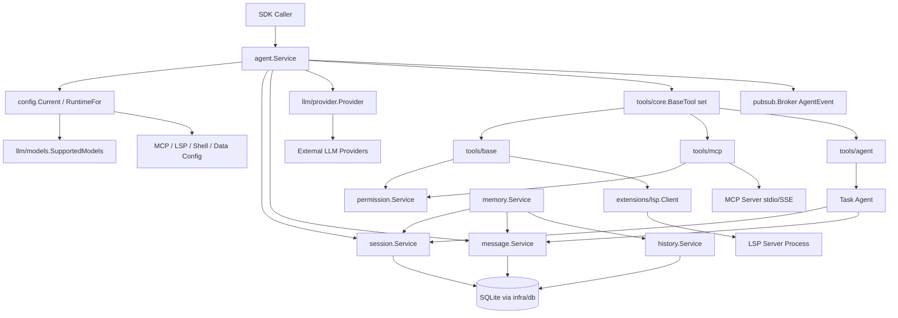
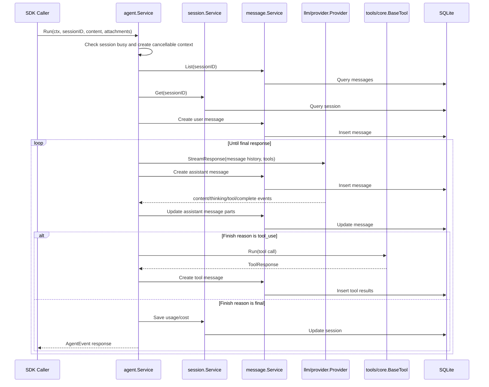
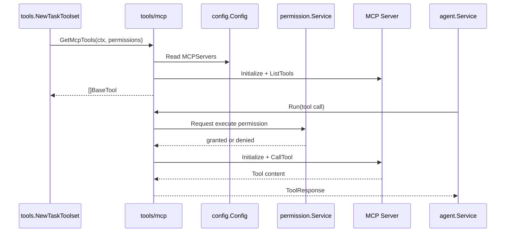

# Agent SDK 系统架构文档

**文档位置**: `docs/architecture.md`  
**生成模式**: `init`  
**最后更新**: 2026-05-06  
**事实来源**: `README.md`、`go.mod`、`agent.go`、`config/*`、`message/*`、`session/*`、`history/*`、`memory/*`、`tools/*`、`llm/*`、`infra/*`、`extensions/*`

---

## 1. 文档概览

### 1.1 文档目标

本文档用于帮助团队理解 Agent SDK 的系统边界、核心模块、运行流程、关键实体和主要约束。内容基于当前仓库中已实现的代码与配置事实，不记录 speckit 过程信息。

### 1.2 系统范围

Agent SDK 是一个 Go 语言实现的可复用 Agent Runtime 包，模块名为 `ferryman-agent`。当前仓库覆盖 Agent 编排、LLM provider 适配、消息与会话持久化、工具执行、权限控制、MCP 工具接入、LSP 扩展、提示词构建、主题/格式/日志/数据库等基础设施。README 中说明该 SDK 正在从原 `internal/*` 语义逐步抽取，因此部分命名仍保留 opencode/ferryman 相关痕迹。

### 1.3 术语说明

| 术语 | 含义 |
|------|------|
| Agent Service | `agent.go` 中的顶层运行接口，负责接收用户输入、调用模型、处理工具调用并发布事件。 |
| Provider | `llm/provider` 中的模型供应商抽象，统一封装 OpenAI、Anthropic、Gemini、Bedrock、Azure、Copilot、VertexAI、OpenRouter、GROQ、XAI、Local、Mock 等实现。 |
| Message | `message.Message`，表示一次对话消息，由文本、推理内容、附件、工具调用、工具结果、结束原因等 `ContentPart` 组成。 |
| Session | `session.Session`，表示一次对话或子任务会话，记录标题、父会话、token 使用量、成本和摘要消息。 |
| Tool | `tools/core.BaseTool`，模型可调用的外部能力，统一通过 `Info()` 暴露 schema，通过 `Run()` 执行。 |
| MCP Tool | 由 `tools/mcp` 从配置的 MCP server 动态发现并包装成 SDK Tool 的外部工具。 |
| LSP Client | `extensions/lsp.Client`，封装语言服务器进程、JSON-RPC 通信、诊断缓存和文件打开状态。 |
| Memory Snapshot | `memory.Snapshot`，聚合指定 session 的会话、消息和最新文件历史。 |

---

## 2. 总体架构说明

### 2.1 架构摘要

系统以 `agent.Service` 为顶层入口，外部调用方通过 `Run`、`Cancel`、`Summarize`、`Update` 等方法驱动 Agent 生命周期。Agent 编排层从配置中选择模型 provider，读取 session/message 历史，将用户输入与附件写入持久化层，并通过 provider 的流式事件逐步更新 assistant message。模型需要工具时，Agent 根据工具名查找 `BaseTool` 实现，执行后将工具结果写回消息历史并继续下一轮生成。

持久化由 SQLite、goose migration 和 sqlc 生成查询层组成，上层以 `session.Service`、`message.Service`、`history.Service` 暴露业务接口。配置层使用 Viper 读取全局与项目本地 `.opencode.json`、环境变量和默认值，并统一决定 provider、agent 模型、数据目录、MCP、LSP、shell、主题等运行参数。

### 2.2 核心模块

| 模块 | 职责 | 主要输入 | 主要输出 | 状态 |
|------|------|----------|----------|------|
| `agent` | 顶层 Agent 编排、请求并发控制、模型流式事件处理、工具循环、标题生成、摘要生成、用量追踪。 | session ID、用户内容、附件、工具集合、配置。 | `AgentEvent`、持久化消息、工具结果、session 成本与 token 更新。 | 已实现 |
| `config` | 加载、合并、校验运行配置，提供 agent/provider/MCP/LSP/shell/theme/data 等设置。 | 环境变量、全局 `.opencode.json`、工作目录 `.opencode.json`、默认值。 | 全局 `Config`、运行时 agent 配置、配置文件更新。 | 已实现 |
| `llm/models` | 定义模型 ID、provider、成本、上下文窗口、附件与推理能力。 | 静态模型定义。 | `SupportedModels` 和 provider 排序信息。 | 已实现 |
| `llm/provider` | 统一 LLM 调用接口，适配多个供应商的 send/stream 行为。 | 消息列表、工具 schema、模型和 provider 配置。 | `ProviderResponse` 或 `ProviderEvent` 流。 | 已实现 |
| `message` | 管理消息实体、内容分片序列化、消息 CRUD 与事件发布。 | session ID、role、content parts、模型 ID。 | `Message`、数据库记录、pubsub 事件。 | 已实现 |
| `session` | 管理会话实体、父子会话、标题、摘要、成本和 token 数据。 | 标题、父 session、tool call ID、session 更新参数。 | `Session`、数据库记录、pubsub 事件。 | 已实现 |
| `history` | 管理会话内文件快照和版本记录。 | session ID、文件路径、内容、版本。 | `File` 历史记录与最新版本查询。 | 已实现 |
| `memory` | 聚合 session、messages、files，形成会话快照。 | session ID。 | `memory.Snapshot`。 | 已实现 |
| `tools/core` | 定义工具接口、工具调用、工具响应和上下文键。 | 工具实现代码。 | 统一的 `BaseTool` 协议。 | 已实现 |
| `tools/base` | 提供基础工具能力，如 bash、ls、view、grep、glob、edit、patch、fetch、diagnostics 等。 | 工具调用参数、权限、工作目录、LSP client。 | 文本工具响应、文件变更、诊断或命令输出。 | 已实现 |
| `tools/mcp` | 根据配置连接 MCP server，发现工具并代理执行。 | MCP 配置、权限服务、工具参数。 | 动态 `BaseTool` 与 MCP 调用结果。 | 已实现 |
| `tools/agent` | 提供子 Agent 工具，创建 task session 并用受限工具集执行搜索/分析任务。 | prompt、父 session、session/message 服务、LSP clients。 | 子 Agent 响应文本、父 session 成本累加。 | 已实现 |
| `permission` | 管理工具执行权限、会话自动批准和持久授权。 | 工具名、动作、路径、session ID、参数。 | 授权结果与权限请求事件。 | 已实现 |
| `extensions/lsp` | 管理语言服务器进程、初始化、诊断、文件打开/关闭、通知和请求处理。 | LSP 命令、工作目录、文件路径、JSON-RPC 消息。 | LSP 结果、诊断缓存、文件状态。 | 已实现 |
| `infra/db` | 建立 SQLite 连接、设置 pragma、执行 goose migration、提供 sqlc 查询层。 | `config.Data.Directory`、SQL migration。 | `*sql.DB` 和 `Queries`。 | 已实现 |
| `infra/logging`、`infra/format`、`infra/theme`、`infra/diff`、`infra/fileutil` | 提供日志、格式化、主题、diff/patch、文件工具等基础能力。 | 运行参数或文件内容。 | 支撑性输出。 | 已实现 |

### 2.3 外部依赖与基础设施

| 依赖 | 用途 | 交互方式 | 状态 |
|------|------|----------|------|
| SQLite (`github.com/ncruces/go-sqlite3`) | 存储 sessions、messages、files。 | 本地 DB 文件 `.opencode/opencode.db`，SQL。 | 已接入 |
| goose | 执行数据库 migration。 | 嵌入式 migration 文件。 | 已接入 |
| sqlc 生成代码 | 类型安全数据库查询。 | Go 查询接口。 | 已接入 |
| Viper | 加载配置、环境变量和默认值。 | 文件与环境变量。 | 已接入 |
| OpenAI SDK | OpenAI/兼容 OpenAI provider 调用。 | HTTP API。 | 已接入 |
| Anthropic SDK | Anthropic provider 调用。 | HTTP API。 | 已接入 |
| Google GenAI | Gemini/VertexAI provider 调用。 | HTTP API / Google Cloud。 | 已接入 |
| AWS SDK / Bedrock | Bedrock provider 调用。 | AWS API。 | 已接入 |
| Azure Identity | Azure provider 认证与调用支撑。 | Azure API。 | 已接入 |
| GitHub Copilot token | Copilot provider 认证。 | 本地 token 文件或环境变量。 | 已接入 |
| MCP Go | MCP server 工具发现与调用。 | stdio 或 SSE。 | 已接入 |
| LSP server 进程 | 代码诊断、符号等语言服务能力。 | 子进程 stdio JSON-RPC。 | 已接入 |
| Bubble Tea / Lipgloss / Chroma / theme 包 | TUI、样式和代码高亮支撑。 | 本地库调用。 | 已接入 |

---

## 3. 总架构流程图

### 3.1 图示说明

- `agent.Service` 是运行时中心，负责把调用方请求转为模型消息、工具调用和持久化更新。
- `config` 和 `llm/models` 决定具体使用的 agent 模型、provider、max tokens、推理参数和系统提示词。
- `session.Service`、`message.Service`、`history.Service` 共用 `infra/db` 查询层，将业务实体落到 SQLite。
- 工具系统通过 `tools/core.BaseTool` 对齐协议，基础工具、MCP 工具和子 Agent 工具都走同一套执行入口。
- `pubsub.Broker` 用于 Agent、Session、Message、File、PermissionRequest 等实体的创建、更新、删除事件订阅。

---

## 4. 核心功能与核心流程图

### 4.1 核心功能概览

| 功能 | 目标 | 关键参与模块 | 当前状态 |
|------|------|--------------|----------|
| Agent 对话生成 | 接收用户输入，流式调用模型，保存 assistant 输出。 | `agent`、`llm/provider`、`message`、`session`、`prompt`。 | 已实现 |
| 工具调用循环 | 处理模型返回的 tool use，执行工具并把结果作为 tool message 写回上下文继续生成。 | `agent`、`tools/core`、`tools/base`、`tools/mcp`、`permission`、`message`。 | 已实现 |
| 会话标题生成 | 在首条用户消息后为 coder agent 异步生成标题。 | `agent`、`config.AgentTitle`、`llm/provider`、`session`。 | 已实现 |
| 会话摘要 | 将已有消息总结为摘要消息，并把 session 指向 `SummaryMessageID`。 | `agent`、`config.AgentSummarizer`、`message`、`session`。 | 已实现 |
| 模型切换 | 在 Agent 非忙碌时更新 agent 模型配置并重建 provider。 | `agent.Update`、`config.UpdateAgentModel`、`llm/models`、`llm/provider`。 | 已实现 |
| MCP 工具接入 | 从配置的 MCP server 动态发现工具，按权限代理执行。 | `tools/mcp`、`config.MCPServer`、`permission`。 | 已实现 |
| LSP 诊断支撑 | 启动语言服务器，维护打开文件与诊断缓存，供工具使用。 | `extensions/lsp`、`tools/base`、`config.LSP`。 | 已实现 |
| 会话记忆快照 | 聚合 session、message、file history 形成上下文快照。 | `memory`、`session`、`message`、`history`。 | 已实现 |

### 4.2 核心流程：Agent 对话生成与工具循环

#### 流程说明

这是系统最核心的运行流程。调用方传入 session ID、用户文本和可选附件，Agent 保存用户消息，调用 provider 获取流式事件，并在模型请求工具时执行工具、保存工具结果，再把扩展后的消息历史继续送回模型，直到模型以非工具调用原因结束。

#### 流程步骤

1. `Run` 检查当前 session 是否忙碌，创建可取消上下文，并在 `activeRequests` 中登记。
2. Agent 读取既有消息；若是空会话且存在 title provider，则异步生成标题。
3. Agent 读取 session；若存在 `SummaryMessageID`，会从摘要消息位置裁剪历史并把摘要消息作为 user role 纳入上下文。
4. Agent 创建新的 user message，将文本和附件转换为 `ContentPart`。
5. Agent 调用 `Provider.StreamResponse`，并为本轮生成创建 assistant message。
6. Provider 事件驱动 assistant message 更新，包括推理内容、文本内容、工具调用开始/结束、完成或错误。
7. 若完成原因是 `tool_use`，Agent 匹配工具名并调用 `BaseTool.Run`，然后创建 tool message 保存所有工具结果，再进入下一轮 provider 调用。
8. 若完成原因不是 `tool_use`，Agent 更新 token、成本等 session 用量，发布并返回 `AgentEventTypeResponse`。
9. 若用户取消或工具权限拒绝，Agent 会写入对应 finish reason，并返回错误事件或权限拒绝状态。

### 4.3 核心流程：MCP 工具发现与执行

#### 流程说明

MCP 工具由 `tools/mcp.GetMcpTools` 根据 `config.Get().MCPServers` 动态构建。工具执行时先通过权限服务请求授权，再按 MCP server 类型建立 stdio 或 SSE client，初始化 MCP 协议并调用目标工具。

#### 流程步骤

1. 工具集构建时读取配置中的 MCP server 列表。
2. 每个 MCP server 依据类型创建 stdio 或 SSE client。
3. MCP client 初始化协议并调用 `ListTools`，每个远端工具被包装为一个本地 `BaseTool`。
4. Agent 执行 MCP 工具时，工具从 context 中读取 session ID 与 message ID，并向权限服务发起执行授权请求。
5. 授权通过后，MCP 工具再次建立 client，初始化并调用远端工具，最后将 MCP 内容转换为 `ToolResponse`。

---

## 5. 实体设计

### 5.1 核心实体

| 实体 | 职责 | 关键属性 | 关联关系 |
|------|------|----------|----------|
| `agent.Service` | 对外暴露 Agent 运行能力并协调 provider、session、message 和 tools。 | `Run`、`Cancel`、`Summarize`、`Update`、`Model`、`Subscribe`。 | 依赖 `session.Service`、`message.Service`、`provider.Provider`、`[]BaseTool`、`pubsub.Broker`。 |
| `agent.AgentEvent` | 表达 Agent 运行期间产生的响应、错误和摘要进度。 | `Type`、`Message`、`Error`、`SessionID`、`Progress`、`Done`。 | 由 Agent 发布，调用方通过订阅或 Run 返回 channel 接收。 |
| `session.Session` | 表示主会话、标题会话或 task 子会话。 | `ID`、`ParentSessionID`、`Title`、`MessageCount`、`PromptTokens`、`CompletionTokens`、`SummaryMessageID`、`Cost`。 | 一对多关联 `message.Message` 与 `history.File`；task session 可通过 `ParentSessionID` 指向父会话。 |
| `message.Message` | 表示会话中的一条 user、assistant、tool 或 system 消息。 | `ID`、`SessionID`、`Role`、`Parts`、`Model`、时间戳。 | 属于一个 `Session`；由多个 `ContentPart` 组成。 |
| `message.ContentPart` | 表示消息内部的具体内容片段。 | `TextContent`、`ReasoningContent`、`ImageURLContent`、`BinaryContent`、`ToolCall`、`ToolResult`、`Finish`。 | 被序列化为 JSON 存储在 messages 表的 `parts` 字段。 |
| `history.File` | 表示会话内某文件的内容快照或版本。 | `ID`、`SessionID`、`Path`、`Content`、`Version`。 | 属于一个 `Session`；同一路径和 session 下按 version 唯一。 |
| `memory.Snapshot` | 表示指定 session 的聚合记忆视图。 | `Session`、`Messages`、`Files`。 | 由 `memory.Service` 聚合 session/message/history 服务产生。 |
| `models.Model` | 表示可用模型及其运行元信息。 | `ID`、`Provider`、`APIModel`、成本、上下文窗口、默认 token、推理与附件能力。 | 被 `config.Agent` 选择，并传入 `provider.Provider`。 |
| `provider.Provider` | 统一模型调用能力。 | `SendMessages`、`StreamResponse`、`Model`。 | 由 `provider.NewProvider` 根据 `models.ModelProvider` 创建具体 client。 |
| `tools/core.BaseTool` | 统一工具协议。 | `Info()`、`Run(ctx, ToolCall)`。 | 被 Agent 提供给 provider 并按 tool call 执行。 |
| `permission.PermissionRequest` | 表示一次工具执行授权请求。 | `ID`、`SessionID`、`ToolName`、`Action`、`Path`、`Params`。 | 由工具发起，通过 `permission.Service` 发布并等待 grant/deny。 |
| `config.Config` | 表示运行配置总对象。 | `Data`、`WorkingDir`、`MCPServers`、`Providers`、`LSP`、`Agents`、`Shell`、`TUI`、`AutoCompact`。 | 被 Agent、Provider、Tools、DB、Prompt、LSP 等模块读取。 |
| `extensions/lsp.Client` | 表示一个语言服务器客户端实例。 | 子进程、请求处理器、通知处理器、诊断缓存、打开文件表、server state。 | 被基础工具使用，连接外部 LSP server 进程。 |

### 5.2 实体关系说明

- `Session` 是持久化边界的核心聚合根；`Message` 与 `File` 都以 `session_id` 外键关联 session，并通过 SQLite cascade delete 清理。
- `Message` 使用 `Parts` 保存多态内容。工具调用和工具结果不单独建业务表，而是作为 `ContentPart` 持久化在消息中。
- `Agent Service` 不直接操作 SQL，它通过 `session.Service`、`message.Service` 和 `history.Service` 间接读写数据库。
- `Provider` 不负责持久化，也不直接执行工具；它只暴露模型响应或流式事件。工具执行由 Agent 在收到 `ToolCall` 后完成。
- `BaseTool` 执行时通过 context 获取当前 `SessionID` 与 `MessageID`，这让工具响应可以追溯到一次具体模型消息。
- `PermissionRequest` 是工具和 UI/调用方之间的授权协作实体；权限服务用 pubsub 发布请求，并用等待通道接收 grant/deny。
- `MCP Tool` 是远端 MCP tool 到本地 `BaseTool` 的适配实体，工具名称按 `mcpName_toolName` 组合生成。
- `Memory Snapshot` 是面向读取的聚合视图，不拥有持久化生命周期。

---

## 6. 关键约束与边界

| 类型 | 内容 | 影响范围 |
|------|------|----------|
| 并发约束 | 同一 session 同时只能处理一个普通请求，`activeRequests` 用 session ID 管理取消函数；摘要请求使用 `sessionID + "-summarize"`。 | Agent 请求调度、取消、模型切换。 |
| 模型切换约束 | `agent.Update` 在 Agent 忙碌时拒绝模型切换，避免运行中的 provider 与配置不一致。 | Agent 运行时配置。 |
| 附件能力约束 | 如果当前模型 `SupportsAttachments` 为 false，`Run` 会忽略传入附件。 | 多模态输入、消息构造。 |
| 工具执行边界 | Provider 只产生 tool call，实际工具匹配、执行、权限处理和 tool result 持久化全部在 Agent 层完成。 | Provider 适配、工具系统、消息历史。 |
| 权限约束 | 非自动批准 session 或非持久授权的敏感工具操作需要 `permission.Service.Request` 等待授权。 | `tools/base`、`tools/mcp`、调用方交互。 |
| Bash 工具安全约束 | Bash 工具内置 banned commands 和 safe read-only commands；非只读命令需要权限。 | Shell 执行能力。 |
| MCP 接入边界 | MCP 工具仅支持配置中声明的 `stdio` 与 `sse` 类型；工具列表会被进程级缓存到 `mcpTools`。 | 外部工具发现与动态更新。 |
| 持久化边界 | 数据目录来自 `config.Data.Directory`，默认 `.opencode`；数据库文件名为 `opencode.db`。 | 本地状态、迁移、部署环境。 |
| 数据一致性约束 | SQLite 开启 foreign keys、WAL、synchronous normal；messages/files 通过外键依赖 sessions，session message count 由 trigger 更新。 | 会话删除、消息统计、文件历史。 |
| 摘要裁剪约束 | 当 session 存在 `SummaryMessageID`，后续生成只保留摘要消息之后的历史，并把摘要消息 role 改为 user。 | 长上下文压缩、对话连续性。 |
| 配置来源边界 | 配置由全局、工作目录本地配置、环境变量和默认值合并；`config.Get()` 是全局单例。 | 初始化顺序、测试隔离、运行时更新。 |
| LSP 边界 | LSP client 管理外部子进程和打开文件状态；诊断依赖 server 成功初始化和文件打开。 | 诊断工具、代码视图工具。 |
| 文档事实边界 | 当前文档仅记录仓库已实现事实；未来 feature 或未落地设计应在对应实现完成后再增量更新。 | 架构文档维护。 |
