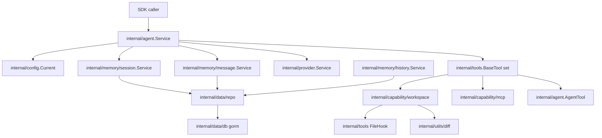

# Agent SDK 架构

最后更新：2026-05-06

本仓库是一个可复用的 Go Agent SDK。它保留了 Agent 编排、Provider 集成、会话/消息/历史服务、权限检查、基础工具、MCP 工具、diff/patch 核心，以及 hook/event 扩展点。它不包含 Skill 工具、CLI/TUI 渲染、终端主题或 IDE/LSP 扩展。

## 边界

| 领域 | 包 | 职责 |
| --- | --- | --- |
| Agent 运行时 | `internal/agent` | 运行对话、流式传递 Provider 事件、执行工具、记录用量，并发布 Agent 事件。 |
| 配置 | `internal/config` | 定义 SDK 配置结构、默认值、校验逻辑，以及用于宿主注入配置的显式 `Use` 入口。 |
| Providers | `internal/provider`、`internal/data/llm/client` | `internal/provider` 提供 Provider 服务与目标选择，`internal/data/llm/client` 适配 OpenAI-compatible、Anthropic、Gemini、Bedrock、Azure、Copilot、VertexAI、OpenRouter、GROQ、XAI、本地和 mock Provider。 |
| 模型元数据 | `internal/data/llm/models` | 定义 `Model`、Provider/Model ID，并从 `models.json` 加载按 Provider 划分的模型示例。 |
| Prompt 解析器 | `internal/prompt` | 加载 JSON/YAML prompt 配置，并按 key 解析 system prompt。默认 prompt 位于 `internal/prompt/prompts.json`。 |
| 数据源 | `internal/data/db` | 打开基于 gorm 的 sqlite/mysql 连接，并负责数据库模型和迁移。 |
| Repositories | `internal/data/repo` | 定义 `SessionRepo`、`MessageRepo`、`HistoryRepo`，以及 repo 错误语义。 |
| Services | `internal/memory/session`、`internal/memory/message`、`internal/memory/history` | 基于 repo 契约暴露领域服务，并发布 pubsub 事件。 |
| 工具协议 | `internal/tools` | 定义 `BaseTool`、工具调用/响应、文件事件、文件 hooks，以及 hook 结果合并逻辑。 |
| 基础工具 | `internal/capability/workspace` | 提供 SDK 安全的工具，例如文件 view/edit/write/patch、grep/glob/ls、bash、fetch 和 sourcegraph。 |
| MCP 工具 | `internal/capability/mcp` | 发现并执行来自已配置 MCP server 的工具。 |
| 子 Agent 工具 | `internal/agent` | 使用会话/消息服务运行受约束的任务 Agent。 |
| Diff 核心 | `internal/utils/diff` | 保留 unified diff 生成、增删统计，以及 patch 解析/应用逻辑。不依赖 renderer 或 theme。 |
| 工具类 | `internal/utils/fileutil`、`internal/data/logging` | 共享文件匹配辅助能力和日志支持。 |

## 已从 SDK 移除

- `extensions/*`，包括 LSP 和补全。
- `infra/format` 和 `infra/theme`。
- 默认 diagnostics 工具，以及基础文件工具中的 LSP diagnostics 后处理。
- 硬编码 prompt 源文件，例如 `internal/prompt/coder.go`、`internal/prompt/title.go`、`internal/prompt/task.go` 和 `internal/prompt/summarizer.go`。
- 旧的 sqlc/goose `infra/db` 运行时路径。

## 运行流程



SDK 调用方构造 services 和 tools，然后调用 `internal/agent.Service.Run`。Agent 通过 service 接口存储用户消息和助手消息，流式传递 Provider 事件，执行匹配的工具，将工具结果写回消息历史，并持续运行，直到 Provider 返回最终响应。

文件工具在核心操作成功后发布 hook 事件：

- `file.viewed`
- `file.edited`
- `file.written`
- `file.patched`

Hook 结果会追加到工具响应内容中，并合并到响应 metadata 的 `hooks` 字段下；原始工具 metadata 则保留在 `tool` 字段下。

## Prompt 配置

Prompts 按 key 解析：

```json
{
  "prompts": {
    "coder": "system prompt",
    "title": "system prompt",
    "task": "system prompt",
    "summarizer": "system prompt"
  }
}
```

`internal/prompt.ResolveSystemPromptByKey(key)` 支持 JSON 和 YAML。如果设置了 `internal/config.PromptConfigPath`，则使用该文件；否则使用内嵌的 `internal/prompt/prompts.json` 默认配置。
