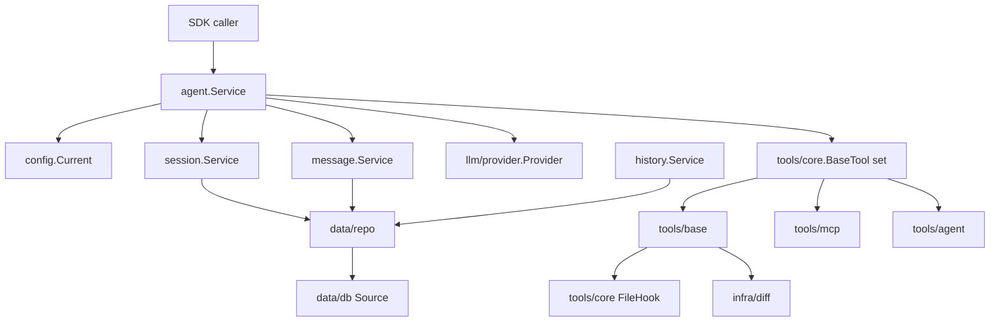

# Agent SDK Architecture

Last updated: 2026-05-06

This repository is a reusable Go Agent SDK. It keeps agent orchestration, provider integration, session/message/history services, permission checks, base tools, MCP tools, diff/patch core, and hook/event extension points. It does not include Skill tools, CLI/TUI rendering, terminal themes, or IDE/LSP extensions.

## Boundaries

| Area | Package | Responsibility |
| --- | --- | --- |
| Agent runtime | `agent` | Runs conversations, streams provider events, executes tools, records usage, and publishes agent events. |
| Configuration | `config` | Loads SDK config, providers, agents, MCP servers, shell settings, context files, and prompt config path. |
| Providers | `llm/provider` | Adapts OpenAI-compatible, Anthropic, Gemini, Bedrock, Azure, Copilot, VertexAI, OpenRouter, GROQ, XAI, local, and mock providers. |
| Model metadata | `llm/models` | Provides provider constants and minimal model resolution. Agent config may use arbitrary model strings with an explicit provider. |
| Prompt resolver | `prompt` | Loads JSON/YAML prompt config and resolves system prompts by key. Default prompts live in `prompt/prompts.json`. |
| Data source | `data/db` | Owns the SDK data source handle used by repositories. |
| Repositories | `data/repo` | Defines `SessionRepo`, `MessageRepo`, `HistoryRepo`, and repo error semantics. |
| Services | `session`, `message`, `history` | Expose domain services over repo contracts and publish pubsub events. |
| Tool protocol | `tools/core` | Defines `BaseTool`, tool calls/responses, file events, file hooks, and hook result merging. |
| Base tools | `tools/base` | Provides SDK-safe tools such as file view/edit/write/patch, grep/glob/ls, bash, fetch, and sourcegraph. |
| MCP tools | `tools/mcp` | Discovers and executes tools from configured MCP servers. |
| Child agent tool | `tools/agent` | Runs a constrained task agent using session/message services. |
| Diff core | `infra/diff` | Keeps unified diff generation, addition/removal stats, and patch parse/apply logic. No renderer or theme dependency. |
| Utilities | `utils/fileutil`, `logging` | Shared file matching helpers and logging support. |

## Removed From SDK

- `extensions/*`, including LSP and completions.
- `infra/format` and `infra/theme`.
- default diagnostics tool and LSP diagnostics post-processing in base file tools.
- hard-coded prompt source files such as `prompt/coder.go`, `prompt/title.go`, `prompt/task.go`, and `prompt/summarizer.go`.
- old sqlc/goose `infra/db` runtime path.

## Runtime Flow



The SDK caller constructs services and tools, then calls `agent.Service.Run`. The agent stores user and assistant messages through service interfaces, streams provider events, executes matching tools, writes tool results back into message history, and continues until the provider returns a final response.

File tools publish hook events after successful core operations:

- `file.viewed`
- `file.edited`
- `file.written`
- `file.patched`

Hook results are appended to the tool response content and merged into response metadata under `hooks`, while the original tool metadata is preserved under `tool`.

## Prompt Configuration

Prompts are resolved by key:

```json
{
  "prompts": {
    "coder": "system prompt",
    "title": "system prompt",
    "task": "system prompt",
    "summarizer": "system prompt"
  }
}
```

`prompt.ResolveSystemPromptByKey(key)` supports JSON and YAML. If `config.PromptConfigPath` is set, that file is used; otherwise the embedded `prompt/prompts.json` defaults are used.
